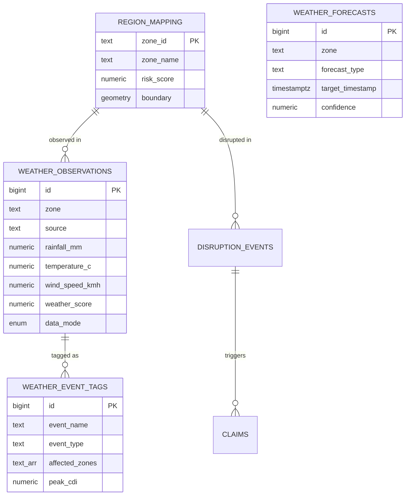
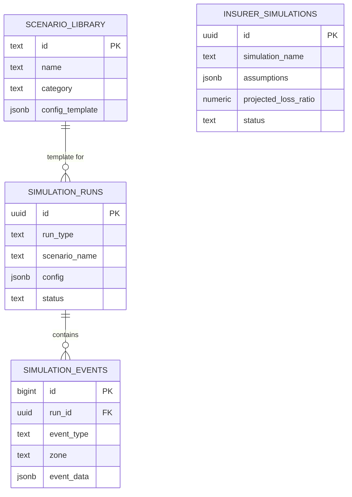

# CovA: Complete Database System Blueprint

> **Document Type**: Implementation-Ready Database Design & Operations Manual  
> **System**: CovA — Dual-Mode Parametric Insurance Intelligence Platform  
> **Scope**: Full end-to-end database ownership — schema, flows, separation, security, scaling, operations  
> **Codebase Basis**: Exhaustive review of `db.js`, `persistent-state.js`, `historical-seeder.js`, `worker-seeder.js`, 9 engine modules, 10 route modules, 3 cron systems, simulation layer  
> **Date**: April 16, 2026  
> **Audience**: Database developer responsible for building and operating the complete database system

---

# TABLE OF CONTENTS

1. [Architecture Overview](#1-architecture-overview)
2. [Current State Assessment](#2-current-state-assessment)
3. [Target Architecture — Production Database](#3-target-architecture)
4. [Mode Separation Strategy (REAL vs DEMO)](#4-mode-separation-strategy)
5. [Complete Schema Design](#5-complete-schema-design)
6. [Data Flow Architecture](#6-data-flow-architecture)
7. [Weather Data System](#7-weather-data-system)
8. [Insurance Core Data](#8-insurance-core-data)
9. [Fraud & Risk System Data](#9-fraud-risk-system-data)
10. [Financial & Actuarial Data](#10-financial-actuarial-data)
11. [Simulation (Demo Mode) Data](#11-simulation-demo-mode-data)
12. [Insurer Simulation Input Data](#12-insurer-simulation-input-data)
13. [Reporting & Business Intelligence Data](#13-reporting-bi-data)
14. [ML System Integration](#14-ml-system-integration)
15. [Real-Time vs Batch Processing](#15-realtime-vs-batch)
16. [API & Application Support](#16-api-application-support)
17. [Indexing & Performance Strategy](#17-indexing-performance)
18. [Security Rules & Access Control](#18-security-access-control)
19. [Data Consistency Rules](#19-data-consistency)
20. [Testing & Edge Case Support](#20-testing-edge-cases)
21. [Lifecycle Management](#21-lifecycle-management)
22. [Migration Plan — SQLite to PostgreSQL](#22-migration-plan)
23. [Implementation Timeline](#23-implementation-timeline)
24. [Entity Relationship Diagrams](#24-er-diagrams)

---

# 1. ARCHITECTURE OVERVIEW

## 1.1 System Context

CovA is a **dual-mode parametric insurance platform** for gig economy workers. The database system must support:

- **Real Product Mode**: Uses real historical data (2–5 years), real weather feeds, real actuarial calculations. Only payment is simulated.
- **Demo Simulation Mode**: High-speed accelerated environment. Every 60–90 seconds triggers simulated extreme events for demonstration.

Both modes share the **same database system** with isolation enforced at the data layer.

## 1.2 Connectivity Requirements

```
┌─────────────────────────────────────────────────────────────────────┐
│                    DATABASE CONNECTIVITY MAP                         │
│                                                                     │
│  WEB APP (React/Vite)  ──┐                                         │
│                           ├──▶ Express.js API ──▶ DATABASE          │
│  ANDROID APP (Kotlin)  ──┘    + WebSocket (ws)    SYSTEM            │
│                                                                     │
│  CRON ENGINES ─────────────────────────────▶ DATABASE SYSTEM        │
│  (poller.js, autonomous-engine.js,                                  │
│   fraud-scheduler.js)                                               │
│                                                                     │
│  ML PIPELINE (Python) ─────────────────────▶ DATABASE SYSTEM        │
│  (Training, inference, feature store)                               │
│                                                                     │
│  EXTERNAL APIs ──▶ Ingestion Service ──────▶ DATABASE SYSTEM        │
│  (OWM, IMD, TomTom, Razorpay, Guidewire)                          │
└─────────────────────────────────────────────────────────────────────┘
```

## 1.3 Technology Stack Decision

| Component | Demo/Current | Production Target | Rationale |
|-----------|-------------|-------------------|-----------|
| **Primary RDBMS** | SQLite 3 (WAL mode, `better-sqlite3`) | PostgreSQL 16 | ACID compliance, concurrent writes, RBAC, extensions |
| **Time-Series** | Flat tables | TimescaleDB (PG extension) | Weather/CDI/telemetry = time-series data; hypertable compression |
| **Geospatial** | Hardcoded zone coords | PostGIS (PG extension) | Actual polygon zones, distance queries, GIS shapefiles |
| **Cache** | In-memory Maps | Redis 7 | CDI EMA state, session tokens, real-time leaderboards |
| **Queue** | Direct function calls | Redis Streams / BullMQ | Event-driven claim processing, fraud pipeline, async payouts |
| **Search** | SQL LIKE queries | pg_trgm + full-text search | Claim search, worker lookup, log search |
| **Monitoring** | Console logs | Prometheus + Grafana | DB metrics, query latency, connection pool health |

---

# 2. CURRENT STATE ASSESSMENT

## 2.1 Existing Schema (SQLite — [db.js](file:///Users/navneethkonduru/Desktop/Guidewire%20Devtrails%2026/cova/backend/data/db.js))

The current system uses **13 tables** across a single SQLite file (`cova.db`, ~4.8MB):

| Table | Rows (Typical) | Purpose | Status |
|-------|----------------|---------|--------|
| `workers` | 110 (10 hardcoded + 100 simulated) | Worker profiles | ✅ Functional |
| `claims` | 3,000–8,000 | Claim records with fraud results | ✅ Production-quality schema |
| `disruption_events` | 2,000–5,000 | CDI breach events per zone | ✅ Working |
| `policies` | 100+ | Insurance policy records | ✅ Working |
| `insurer_config` | 5 rows | Insurer-adjustable parameters | ✅ Working |
| `admin_config` | 4 rows | System-level configuration | ✅ Working |
| `simulation_state` | 1 row | Current demo scenario | ⚠️ Minimal |
| `worker_signals` | 100 | GNSS/gyro telemetry per worker | ✅ Working |
| `payout_log` | 1,500–4,000 | Payment transaction records | ✅ Working |
| `daily_snapshots` | 60–75 | Daily aggregated metrics | ✅ Working |
| `process_log` | Unbounded | Engine trace/debug logs | ✅ Working |
| `system_metrics` | ~10 | KV store for cumulative counters | ✅ Working |
| `system_events` | 5,000–15,000 | Timestamped event log | ✅ Working |

## 2.2 Current Indexes (from [db.js:177-186](file:///Users/navneethkonduru/Desktop/Guidewire%20Devtrails%2026/cova/backend/data/db.js#L177-L186))

```sql
idx_workers_zone_status    ON workers(zone, status)
idx_claims_worker          ON claims(workerId, date)
idx_claims_status          ON claims(status)
idx_claims_date_status     ON claims(date, status)
idx_disruptions_zone_time  ON disruption_events(zone, timestamp)
idx_policies_worker        ON policies(workerId, status)
idx_process_log_ts         ON process_log(timestamp)
idx_process_log_corr       ON process_log(correlation_id)
```

## 2.3 Current Pragmas (from [db.js:11-15](file:///Users/navneethkonduru/Desktop/Guidewire%20Devtrails%2026/cova/backend/data/db.js#L11-L15))

```sql
journal_mode = WAL          -- Write-ahead logging for concurrent reads
synchronous = NORMAL        -- Balance durability/performance
busy_timeout = 5000         -- 5s retry on lock contention
foreign_keys = ON           -- Referential integrity enforced
cache_size = -20000         -- 20MB page cache
```

## 2.4 Gaps Identified

| Gap | Impact | Resolution |
|-----|--------|-----------|
| No mode separation column | Cannot distinguish real vs demo data | Add `data_mode` discriminator to all content tables |
| No weather history table | No persistent weather storage | Create `weather.observations` + `weather.forecasts` hypertables |
| No telemetry time-series | `worker_signals` stores only latest | Create `telemetry_raw` hypertable for full history |
| No financial projections | Loss ratio computed on-the-fly | Create `financial.snapshots` and `actuarial_projections` tables |
| No simulation run tracking | Cannot replay or compare simulations | Create `simulation.runs` + `simulation.events` tables |
| No ML feature store | Features computed inline | Create `feature_store` + `model_registry` + `model_predictions` |
| No report storage | Reports generated live | Create `generated_reports` table with JSONB output |
| No audit trail | No change-tracking | Create `audit_log` table with row-level change tracking |
| Single-threaded SQLite | Cannot handle concurrent Android+Web writes | Migrate to PostgreSQL with connection pooling |
| No geospatial support | Zones are string enum | PostGIS polygons for accurate zone containment queries |

---

# 3. TARGET ARCHITECTURE

## 3.1 Database Topology

```
┌──────────────────────────────────────────────────────────────────────┐
│                 PRODUCTION DATABASE ARCHITECTURE                      │
│                                                                      │
│  ┌─────────────────────────────────────────────────────────────────┐ │
│  │                    PostgreSQL 16 Cluster                         │ │
│  │                                                                 │ │
│  │  PRIMARY (Read/Write)                                           │ │
│  │  ├── Extensions: TimescaleDB, PostGIS, pg_trgm, pgcrypto      │ │
│  │  ├── Connection Pool: PgBouncer (max 100 connections)          │ │
│  │  ├── WAL Archiving: Enabled for PITR                           │ │
│  │  │                                                             │ │
│  │  │  SCHEMAS:                                                   │ │
│  │  │  ├── public          → Core insurance tables                │ │
│  │  │  ├── weather         → Weather observations + forecasts     │ │
│  │  │  ├── fraud           → Fraud detection + risk scoring       │ │
│  │  │  ├── financial       → Actuarial + P&L + projections        │ │
│  │  │  ├── simulation      → Demo mode data + run tracking        │ │
│  │  │  ├── ml              → Feature store + model registry       │ │
│  │  │  ├── reporting       → Generated reports + BI snapshots     │ │
│  │  │  └── system          → Logs, events, metrics, audit         │ │
│  │  │                                                             │ │
│  │  READ REPLICA (Read-Only)                                      │ │
│  │  ├── Dashboard queries routed here                             │ │
│  │  ├── Report generation reads from replica                      │ │
│  │  └── ML training data export from replica                      │ │
│  └─────────────────────────────────────────────────────────────────┘ │
│                                                                      │
│  ┌─────────────────────────────────────────────────────────────────┐ │
│  │                    Redis 7 Cluster                               │ │
│  │                                                                 │ │
│  │  DB 0: Session tokens (JWT blacklist, active sessions)         │ │
│  │  DB 1: CDI EMA state cache (per-zone smoothed values)          │ │
│  │  DB 2: Real-time event stream (Redis Streams for WS fan-out)   │ │
│  │  DB 3: Rate limiting counters (API throttle per client)        │ │
│  │  DB 4: Feature cache (hot ML features for inference)           │ │
│  └─────────────────────────────────────────────────────────────────┘ │
│                                                                      │
│  ┌─────────────────────────────────────────────────────────────────┐ │
│  │                    Managed Services                             │ │
│  │                                                                 │ │
│  │  Neon PostgreSQL: DATABASE_URL already configured (.env)        │ │
│  │  OR                                                             │ │
│  │  AWS RDS PostgreSQL with TimescaleDB AMI                       │ │
│  │  Redis: Upstash / AWS ElastiCache                              │ │
│  └─────────────────────────────────────────────────────────────────┘ │
└──────────────────────────────────────────────────────────────────────┘
```

## 3.2 Connection Architecture

```
┌──────────────────────────────────────────────────────────────────────┐
│                    CONNECTION POOLING                                 │
│                                                                      │
│  Application Layer (Express.js)                                      │
│  ├── node-postgres (pg) + pg-pool                                   │
│  │   ├── Pool size: 20 connections (primary)                        │
│  │   ├── Pool size: 10 connections (read replica)                   │
│  │   ├── Statement timeout: 30s                                     │
│  │   ├── Idle timeout: 10s                                          │
│  │   └── Connection timeout: 5s                                     │
│  │                                                                  │
│  ├── ioredis (Redis client)                                         │
│  │   ├── maxRetriesPerRequest: 3                                    │
│  │   ├── connectTimeout: 5s                                         │
│  │   └── lazyConnect: true                                          │
│  │                                                                  │
│  └── PgBouncer (if self-hosted)                                     │
│      ├── Mode: transaction pooling                                  │
│      ├── Max client connections: 200                                │
│      └── Default pool size: 20                                      │
│                                                                      │
│  Android App                                                         │
│  ├── Uses SAME REST API endpoints (no direct DB connection)         │
│  ├── Local SQLite cache for offline mode                            │
│  └── Sync endpoint: POST /api/sync with lastSyncTimestamp           │
│                                                                      │
│  ML Pipeline (Python)                                                │
│  ├── psycopg2 connection pool (5 connections)                       │
│  ├── Read replica only for training data export                     │
│  └── Write to primary for model_predictions, feature_store          │
└──────────────────────────────────────────────────────────────────────┘
```

---

# 4. MODE SEPARATION STRATEGY

## 4.1 Core Design Decision: Shared Tables with Discriminator Column

> [!IMPORTANT]
> All content tables that store user-facing data include a `data_mode` column. This is the **single source of truth** for real vs demo data separation.

```sql
-- data_mode ENUM applied to all content tables
CREATE TYPE data_mode_enum AS ENUM ('real', 'demo', 'test');
```

### 4.1.1 Why Shared Tables (Not Separate Databases)

| Approach | Pros | Cons | Decision |
|----------|------|------|----------|
| **Separate databases** | Hard isolation | Schema drift, 2x migration effort, complex joins | ❌ Rejected |
| **Separate schemas** | Namespace isolation | Same migration/drift issues | ❌ Rejected |
| **Shared tables + discriminator** | Single schema, easy queries, mode-aware indexes | Requires discipline in all queries | ✅ Selected |
| **Materialized views per mode** | Clean read separation | Write overhead, refresh lag | Hybrid (used for dashboards) |

### 4.1.2 Implementation Rules

**Rule 1: Every INSERT must include `data_mode`**
```sql
-- Application layer determines mode from process.env.COVA_MODE
INSERT INTO claims (id, workerId, ..., data_mode)
VALUES ($1, $2, ..., $3);  -- $3 = 'real' or 'demo'
```

**Rule 2: Every SELECT must filter by `data_mode`**
```sql
-- Dashboard query
SELECT COUNT(*) FROM claims WHERE data_mode = $1 AND status = 'paid';
```

**Rule 3: Mode is determined at application startup**
```javascript
// server.js
const COVA_MODE = process.env.COVA_MODE || 'demo'; // 'real' | 'demo'
app.locals.dataMode = COVA_MODE;
```

**Rule 4: Demo data can be purged without affecting real data**
```sql
-- Admin operation: reset demo environment
DELETE FROM claims WHERE data_mode = 'demo';
DELETE FROM weather.observations WHERE data_mode = 'demo';
DELETE FROM simulation.events WHERE data_mode = 'demo';
-- Real data is untouched
```

**Rule 5: Cross-mode queries are explicitly prohibited**
```sql
-- Application middleware enforces this
-- No query may combine data_mode = 'real' AND data_mode = 'demo'
-- Exception: System admin reports comparing modes
```

### 4.1.3 Mode Switching at Database Level

```
┌─────────────────────────────────────────────────────────────────────┐
│                    MODE SWITCHING FLOW                                │
│                                                                     │
│  Admin Panel Toggle (frontend)                                       │
│       │                                                             │
│       ▼                                                             │
│  POST /api/admin/mode { mode: 'demo' | 'real' }                    │
│       │                                                             │
│       ▼                                                             │
│  1. Write to system.config: current_mode = 'demo'                   │
│  2. Set app.locals.dataMode = 'demo'                                │
│  3. Broadcast WS: MODE_SWITCH { mode: 'demo' }                     │
│  4. If demo → start autonomous-engine, fraud-scheduler              │
│  5. If real → stop autonomous-engine, start real weather polling     │
│  6. All subsequent DB operations use new data_mode value             │
│       │                                                             │
│       ▼                                                             │
│  Frontend reloads dashboard with mode-filtered data                  │
└─────────────────────────────────────────────────────────────────────┘
```

### 4.1.4 Tables Requiring `data_mode` Column

| Table | Needs `data_mode` | Reason |
|-------|-------------------|--------|
| `workers` | ✅ YES | Real workers vs simulated (SIM_W*) workers |
| `claims` | ✅ YES | Real claims vs demo-generated claims |
| `policies` | ✅ YES | Real policies vs simulated policies |
| `disruption_events` | ✅ YES | Real CDI events vs accelerated events |
| `weather.observations` | ✅ YES | Real IMD data vs mock-API data |
| `weather.forecasts` | ✅ YES | Real OWM forecasts vs simulated forecasts |
| `payout_log` | ✅ YES | Real UPI transactions vs simulated |
| `daily_snapshots` | ✅ YES | Real metrics vs demo metrics |
| `fraud.detection_log` | ✅ YES | Real fraud vs injected ghost workers |
| `financial.snapshots` | ✅ YES | Real P&L vs demo P&L |
| `insurer_config` | ❌ NO | Shared config applies to both modes |
| `admin_config` | ❌ NO | Shared system config |
| `system.events` | ❌ NO | System events are mode-tagged in metadata |
| `system.metrics` | ❌ NO | Cumulative counters are global |
| `ml.feature_store` | ✅ YES | Training features must be tagged |

---

# 5. COMPLETE SCHEMA DESIGN

## 5.1 Schema Organization

```
PostgreSQL Database: cova_db
├── Schema: public           (Core insurance entities)
├── Schema: weather          (Weather data system)
├── Schema: fraud            (Fraud detection & risk)
├── Schema: financial        (Actuarial & financial)
├── Schema: simulation       (Demo mode & scenario runs)
├── Schema: ml               (ML feature store & models)
├── Schema: reporting        (Reports & BI)
└── Schema: system           (Operations & audit)
```

## 5.2 Schema: `public` — Core Insurance Entities

### 5.2.1 Table: `public.workers`

```sql
CREATE TABLE public.workers (
    -- Identity
    id              TEXT PRIMARY KEY,                    -- 'W001', 'SIM_W001'
    name            TEXT NOT NULL,                       -- 'Raju Kumar'
    email           TEXT UNIQUE,                         -- 'raju@example.com'
    phone           TEXT,                               -- '9876543210'
    phone_hash      TEXT,                               -- SHA-256 for dedup
    aadhaar_hash    TEXT,                               -- SHA-256 of Aadhaar (never store raw)
    
    -- Profile
    zone            TEXT NOT NULL,                       -- 'ZONE_A', 'ZONE_B', 'ZONE_C'
    platform        TEXT NOT NULL,                       -- 'zepto', 'blinkit', 'swiggy_instamart'
    archetype       TEXT NOT NULL DEFAULT 'balanced',    -- 'heavy_peak', 'balanced', 'casual'
    hourly_rate     NUMERIC(10,2) NOT NULL DEFAULT 120,  -- Rs 80, 120, 150
    
    -- Status
    status          TEXT NOT NULL DEFAULT 'active',      -- 'active', 'inactive', 'suspended', 'churned'
    enrolled_date   DATE NOT NULL DEFAULT CURRENT_DATE,
    
    -- UPI (for payouts)
    upi_id          TEXT,                               -- 'worker@okaxis'
    
    -- Flags
    is_simulated    BOOLEAN NOT NULL DEFAULT FALSE,      -- TRUE for SIM_W* workers
    daily_claims_cap NUMERIC(4,1) NOT NULL DEFAULT 8.0,  -- Max claimable hours/day
    seasonal_factor NUMERIC(4,2) NOT NULL DEFAULT 1.0,   -- Monsoon loading factor
    peak_hours_per_week NUMERIC(4,1) DEFAULT 20,         -- Declared peak hours
    
    -- Mode
    data_mode       data_mode_enum NOT NULL DEFAULT 'demo',
    
    -- Timestamps
    created_at      TIMESTAMPTZ NOT NULL DEFAULT NOW(),
    updated_at      TIMESTAMPTZ NOT NULL DEFAULT NOW()
);

-- Indexes
CREATE INDEX idx_workers_zone_status ON public.workers(zone, status);
CREATE INDEX idx_workers_data_mode ON public.workers(data_mode);
CREATE INDEX idx_workers_platform ON public.workers(platform);
CREATE INDEX idx_workers_archetype ON public.workers(archetype);
CREATE INDEX idx_workers_status ON public.workers(status);

-- Trigger: auto-update updated_at
CREATE TRIGGER trg_workers_updated_at
    BEFORE UPDATE ON public.workers
    FOR EACH ROW EXECUTE FUNCTION system.update_timestamp();
```

### 5.2.2 Table: `public.policies`

```sql
CREATE TABLE public.policies (
    id              TEXT PRIMARY KEY,                    -- 'POL_SIM_001', 'POL_REAL_001'
    worker_id       TEXT NOT NULL REFERENCES public.workers(id) ON DELETE CASCADE,
    worker_name     TEXT,                               -- Denormalized for fast reads
    
    -- Policy details
    zone            TEXT NOT NULL,
    platform        TEXT,
    archetype       TEXT,
    weekly_premium  NUMERIC(10,2) NOT NULL,              -- Rs 19-89
    daily_cover_cap NUMERIC(10,2) NOT NULL DEFAULT 960,  -- Max daily payout
    
    -- Status
    status          TEXT NOT NULL DEFAULT 'active',       -- 'active', 'lapsed', 'cancelled', 'expired'
    effective_date  DATE NOT NULL,
    expiry_date     DATE NOT NULL,
    
    -- Payment tracking
    upi_id          TEXT,
    payment_txn_id  TEXT,                               -- Premium payment reference
    payment_ref     TEXT,
    last_premium_date DATE,                             -- Last premium collection date
    premiums_paid   INTEGER NOT NULL DEFAULT 0,          -- Count of premiums collected
    
    -- Mode
    data_mode       data_mode_enum NOT NULL DEFAULT 'demo',
    
    -- Timestamps
    created_at      TIMESTAMPTZ NOT NULL DEFAULT NOW(),
    updated_at      TIMESTAMPTZ NOT NULL DEFAULT NOW()
);

-- Indexes
CREATE INDEX idx_policies_worker ON public.policies(worker_id, status);
CREATE INDEX idx_policies_status ON public.policies(status);
CREATE INDEX idx_policies_data_mode ON public.policies(data_mode);
CREATE INDEX idx_policies_expiry ON public.policies(expiry_date) WHERE status = 'active';

-- Trigger: auto-update
CREATE TRIGGER trg_policies_updated_at
    BEFORE UPDATE ON public.policies
    FOR EACH ROW EXECUTE FUNCTION system.update_timestamp();
```

### 5.2.3 Table: `public.claims`

```sql
CREATE TABLE public.claims (
    id                  TEXT PRIMARY KEY,                 -- 'CLM_1234_ABCD1234'
    worker_id           TEXT NOT NULL REFERENCES public.workers(id) ON DELETE CASCADE,
    policy_id           TEXT REFERENCES public.policies(id),
    worker_name         TEXT,                            -- Denormalized
    
    -- Disruption context
    zone                TEXT NOT NULL,
    disruption_type     TEXT NOT NULL,                    -- 'SEVERE_WEATHER','PLATFORM_OUTAGE','EXTREME_HEAT','CYCLONE','CIVIC_CURFEW'
    date                DATE NOT NULL,
    time_slot           TEXT NOT NULL,                    -- 'peak', 'active', 'off'
    hours_lost          NUMERIC(4,1) NOT NULL,            -- 0.0-8.0
    
    -- CDI data
    cdi                 NUMERIC(6,4) NOT NULL,            -- 0.0000-1.0000
    trigger_level       TEXT NOT NULL,                    -- 'none', 'watch', 'standard', 'critical'
    
    -- Validation
    validation_status   TEXT NOT NULL,                    -- 'approved', 'rejected'
    validation_reason   TEXT,
    
    -- Payout
    payout_amount       NUMERIC(10,2) NOT NULL DEFAULT 0,
    payout_txn_id       TEXT,                            -- Razorpay/UPI transaction ID
    
    -- AI
    ai_explanation      TEXT,                            -- Groq-generated explanation
    
    -- Fraud
    fraud_result        JSONB,                           -- Full TCHC analysis result
    fraud_confidence    NUMERIC(6,4) DEFAULT 0.0,        -- 0.0000-1.0000
    
    -- Status
    status              TEXT NOT NULL DEFAULT 'pending',  -- 'pending','pending_payment','paid','flagged','rejected'
    
    -- Mode
    data_mode           data_mode_enum NOT NULL DEFAULT 'demo',
    
    -- Timestamps
    created_at          TIMESTAMPTZ NOT NULL DEFAULT NOW(),
    updated_at          TIMESTAMPTZ NOT NULL DEFAULT NOW()
);

-- Indexes
CREATE INDEX idx_claims_worker_date ON public.claims(worker_id, date);
CREATE INDEX idx_claims_status ON public.claims(status);
CREATE INDEX idx_claims_date_status ON public.claims(date, status);
CREATE INDEX idx_claims_data_mode ON public.claims(data_mode);
CREATE INDEX idx_claims_zone_date ON public.claims(zone, date);
CREATE INDEX idx_claims_disruption ON public.claims(disruption_type);
CREATE INDEX idx_claims_fraud_confidence ON public.claims(fraud_confidence) WHERE fraud_confidence > 0.45;
CREATE INDEX idx_claims_created_at ON public.claims(created_at);

-- GIN index on fraud_result JSONB for filtering by fraud flags
CREATE INDEX idx_claims_fraud_jsonb ON public.claims USING GIN (fraud_result jsonb_path_ops);

-- Trigger
CREATE TRIGGER trg_claims_updated_at
    BEFORE UPDATE ON public.claims
    FOR EACH ROW EXECUTE FUNCTION system.update_timestamp();
```

### 5.2.4 Table: `public.disruption_events` (Hypertable)

```sql
CREATE TABLE public.disruption_events (
    id              BIGSERIAL PRIMARY KEY,
    zone            TEXT NOT NULL,
    condition       TEXT NOT NULL,                       -- 'clear','light_rain','heavy_rain','extreme_heat','cyclone'
    cdi             NUMERIC(6,4) NOT NULL,
    
    -- Signal breakdown
    weather_score   NUMERIC(6,4),
    demand_score    NUMERIC(6,4),
    peer_score      NUMERIC(6,4),
    
    -- Context
    narrative       TEXT,                                -- Human-readable disruption description
    trigger_level   TEXT,                                -- 'none','watch','standard','critical'
    
    -- Mode
    data_mode       data_mode_enum NOT NULL DEFAULT 'demo',
    
    timestamp       TIMESTAMPTZ NOT NULL DEFAULT NOW()
);

-- Convert to TimescaleDB hypertable for time-series queries
SELECT create_hypertable('public.disruption_events', 'timestamp');

-- Indexes
CREATE INDEX idx_disruption_zone_time ON public.disruption_events(zone, timestamp DESC);
CREATE INDEX idx_disruption_data_mode ON public.disruption_events(data_mode, timestamp DESC);
```

### 5.2.5 Table: `public.payout_log`

```sql
CREATE TABLE public.payout_log (
    id              BIGSERIAL PRIMARY KEY,
    claim_id        TEXT NOT NULL REFERENCES public.claims(id) ON DELETE CASCADE,
    worker_id       TEXT NOT NULL REFERENCES public.workers(id) ON DELETE CASCADE,
    
    amount          NUMERIC(10,2) NOT NULL,
    status          TEXT NOT NULL DEFAULT 'success',     -- 'success','failed','pending','reversed'
    payment_method  TEXT DEFAULT 'UPI',                  -- 'UPI','bank_transfer','simulated'
    payment_provider TEXT DEFAULT 'Razorpay',            -- 'Razorpay','simulated'
    txn_reference   TEXT,                               -- External payment reference
    
    metadata        JSONB DEFAULT '{}',                  -- { method, provider, txnId, ... }
    error_message   TEXT,                               -- If status = 'failed'
    retry_count     INTEGER DEFAULT 0,
    
    -- Mode
    data_mode       data_mode_enum NOT NULL DEFAULT 'demo',
    
    created_at      TIMESTAMPTZ NOT NULL DEFAULT NOW()
);

CREATE INDEX idx_payout_claim ON public.payout_log(claim_id);
CREATE INDEX idx_payout_worker ON public.payout_log(worker_id);
CREATE INDEX idx_payout_status ON public.payout_log(status);
CREATE INDEX idx_payout_data_mode ON public.payout_log(data_mode);
```

### 5.2.6 Table: `public.worker_signals`

```sql
CREATE TABLE public.worker_signals (
    worker_id               TEXT PRIMARY KEY REFERENCES public.workers(id) ON DELETE CASCADE,
    
    -- Location
    lat                     NUMERIC(10,6),
    lng                     NUMERIC(10,6),
    geom                    GEOMETRY(Point, 4326),       -- PostGIS point for spatial queries
    
    -- GNSS telemetry
    gnss_variance           NUMERIC(8,4),
    velocity                NUMERIC(8,4),                -- km/h
    zone_entry              TEXT,                         -- Zone entry timestamp
    
    -- Platform state
    platform_active         BOOLEAN DEFAULT TRUE,
    signal_mode             TEXT DEFAULT 'auto_genuine',  -- 'auto_genuine', 'auto_fraud'
    
    -- TCHC Hardware signals
    satellite_count         INTEGER,
    cn0_mean                NUMERIC(6,2),
    cn0_stddev              NUMERIC(6,2),
    signal_authenticity_score NUMERIC(5,3),               -- 0.000-1.000
    
    -- Device info (for fraud blacklisting)
    device_id               TEXT,
    device_model            TEXT,
    os_version              TEXT,
    
    updated_at              TIMESTAMPTZ NOT NULL DEFAULT NOW()
);

-- Trigger: auto-update timestamp
CREATE TRIGGER trg_worker_signals_updated_at
    BEFORE UPDATE ON public.worker_signals
    FOR EACH ROW EXECUTE FUNCTION system.update_timestamp();

-- Spatial index for PostGIS
CREATE INDEX idx_worker_signals_geom ON public.worker_signals USING GIST (geom);
```

### 5.2.7 Table: `public.insurer_config`

```sql
CREATE TABLE public.insurer_config (
    key             TEXT PRIMARY KEY,
    value           TEXT NOT NULL,
    min_value       NUMERIC,
    max_value       NUMERIC,
    description     TEXT,                               -- Human-readable parameter description
    updated_at      TIMESTAMPTZ NOT NULL DEFAULT NOW(),
    updated_by      TEXT,                               -- Who changed it
    
    -- JSON validation constraint
    CONSTRAINT chk_covered_zones CHECK (
        (key = 'covered_zones' AND value::jsonb IS NOT NULL) OR
        (key != 'covered_zones')
    )
);

-- Default seed data:
-- base_premium_rate: 35 (min 29, max 89)
-- max_payout_per_event: 1200 (min 500, max 2000)
-- cdi_trigger_threshold: 0.6 (min 0.5, max 0.8)
-- covered_zones: ["ZONE_A","ZONE_B","ZONE_C"]
-- weekly_coverage_cap: 3000 (min 1000, max 5000)
```

### 5.2.8 Table: `public.admin_config`

```sql
CREATE TABLE public.admin_config (
    key             TEXT PRIMARY KEY,
    value           TEXT NOT NULL,
    description     TEXT,
    updated_at      TIMESTAMPTZ NOT NULL DEFAULT NOW(),
    updated_by      TEXT,
    
    CONSTRAINT chk_json_configs CHECK (
        (key IN ('cdi_weights','fraud_rules','zone_risk_factors') AND value::jsonb IS NOT NULL)
        OR key NOT IN ('cdi_weights','fraud_rules','zone_risk_factors')
    )
);

-- Default seed data:
-- cdi_weights: {"weather":0.40,"demand":0.35,"peer":0.25}
-- fraud_rules: {16 rule definitions with enabled/threshold/action}
-- zone_risk_factors: {"ZONE_A":1.0,"ZONE_B":1.3,"ZONE_C":0.8}
-- cdi_strategy: "any_dominant"
-- autonomous_fraud_enabled: "true"
```

## 5.3 Schema: `weather` — Weather Data System

### 5.3.1 Table: `weather.observations` (Hypertable)

> [!IMPORTANT]
> **This is the single most critical table in CovA.** Every CDI computation, every claim trigger, every premium calculation, and every insurer report traces back to a row in this table. It is the "ground truth" of parametric insurance.

#### Column-by-Column Rationale

| Column | Type | Why This Exists | Used By |
|--------|------|----------------|--------|
| `rainfall_mm` | NUMERIC(8,2) | **CDI Component 1 (Weight 0.40)**: The primary parametric trigger. 40mm/hr = IMD "Heavy" = CDI watch. 65mm/hr = IMD "Very Heavy" = CDI trigger. Without hourly rainfall, we cannot compute if a disruption occurred. | CDI Engine, ML Training, Insurer Reports |
| `temperature_c` | NUMERIC(6,2) | **Heat Dome Detection**: Delivery riders collapse above 42°C. This is the trigger for "EXTREME_HEAT" disruption type. India's labor advisory recommends outdoor work stops above 43°C. | CDI Engine (heat score), Worker Safety Alerts |
| `wind_speed_kmh` | NUMERIC(8,2) | **Cyclone Events**: Winds above 60 km/h make two-wheeler delivery impossible. This is a secondary CDI amplifier (adds up to 0.2 to weather score). Also used for storm propagation modeling. | CDI Engine, Storm Propagation, Insurer Simulation |
| `wind_direction` | NUMERIC(5,1) | **Storm Path Prediction**: If wind is blowing NE→SW from Bay of Bengal toward Bangalore, adjacent zones get a "propagation alert." Without direction, we cannot predict which zone gets hit next. | Weather Intelligence (forecast correction) |
| `humidity_pct` | NUMERIC(5,2) | **Heat Index Calculation**: 40°C at 30% humidity feels different from 40°C at 90% humidity. We compute "Feels Like" temperature for accurate heat disruption scoring. | Heat Index Computation, Worker Risk Alerts |
| `pressure_hpa` | NUMERIC(8,2) | **Storm Onset Detection**: A rapid pressure drop (>5 hPa in 3 hours) is the earliest indicator of an incoming squall. This gives CovA a 2-4 hour advance warning to alert workers. | Weather Intelligence (short-term prediction) |
| `visibility_km` | NUMERIC(8,2) | **Fog/Smog Events**: Visibility below 1 km makes delivery dangerous (especially 4 AM—8 AM shifts). Used for early-morning disruption triggers that rainfall alone would miss. | CDI Engine (secondary), Safety Notifications |
| `aqi` | INTEGER | **Composite Air Quality Index (0-500)**: When AQI exceeds 300 ("Very Poor"), platforms often reduce operations. AQI > 400 ("Severe") = effective outdoor work stoppage = CDI override possible. | CDI Engine (health disruption), Long-term Risk Projection |
| `pm25` | NUMERIC(8,2) | **Fine Particulate (μg/m³)**: The most dangerous pollutant for outdoor workers. PM2.5 > 250 μg/m³ = "Severe" health risk. Stored separately from AQI because different pollutants have different health effects. | Health Risk Scoring, Respiratory Coverage |
| `pm10` | NUMERIC(8,2) | **Coarse Particulate (μg/m³)**: Dust storms + construction dust. PM10 spikes during post-monsoon dry season. Helps distinguish "dust disruption" from "pollution disruption." | AQI Decomposition, Seasonal Pattern Analysis |
| `no2` | NUMERIC(8,2) | **Nitrogen Dioxide (μg/m³)**: Traffic-correlated pollutant. A spike in NO2 often correlates with high congestion = low demand for delivery = lower peer activity score. | Demand Correlation (indirect CDI influence) |
| `o3` | NUMERIC(8,2) | **Ozone (μg/m³)**: Ground-level ozone peaks during hot afternoons (12 PM—4 PM). Combined with temperature, this creates the "Compound Heat + Pollution" disruption event. | Compound Event Detection, Afternoon Risk Windows |
| `weather_score` | NUMERIC(6,4) | **Normalized 0-1 Score**: The computed output of `normalizeWeatherScore()`. This is the exact value that feeds into `CDI = 0.40 × weather_score + 0.35 × demand + 0.25 × peer`. Pre-computed and stored to avoid recalculation. | CDI Engine (direct input), Dashboard Gauge |
| `station_id` | TEXT | **IMD AWS Station Mapping**: Bangalore has multiple AWS stations. Ties each observation to the physical sensor that generated it, enabling accuracy validation and sensor-drift detection. | Data Quality, IMD Cross-validation |
| `source` | TEXT | **Provenance Tracking**: Distinguishes IMD ground-truth data from OWM API estimates from Mock API demo data. Critical for ML training — we only train on `source = 'imd_aws'` data, never on mock data. | ML Data Filtering, Audit Trail |
| `data_mode` | ENUM | **Real vs Demo Isolation**: Ensures that simulated "150mm/hr mega monsoon" demo events never corrupt the real 5-year historical record. | Mode Separation (all queries filter by this) |

```sql
CREATE TABLE weather.observations (
    id              BIGSERIAL,
    zone            TEXT NOT NULL,
    source          TEXT NOT NULL,                       -- 'imd_aws','owm_api','cpcb','mock','autonomous_engine'
    
    -- Core Measurements (from IMD AWS / OpenWeatherMap)
    rainfall_mm     NUMERIC(8,2),                       -- mm/hr — PRIMARY CDI trigger
    temperature_c   NUMERIC(6,2),                       -- Celsius — heat disruption trigger
    wind_speed_kmh  NUMERIC(8,2),                       -- km/h — cyclone/storm trigger
    wind_direction  NUMERIC(5,1),                       -- 0-360 degrees — storm path prediction
    humidity_pct    NUMERIC(5,2),                       -- 0-100% — heat index calculation
    pressure_hpa    NUMERIC(8,2),                       -- hPa — storm onset detection (rapid drop = incoming squall)
    visibility_km   NUMERIC(8,2),                       -- km — fog/smog event trigger
    
    -- Air Quality (from CPCB CAAQMS / data.gov.in)
    aqi             INTEGER,                            -- Composite Air Quality Index (0-500)
    pm25            NUMERIC(8,2),                       -- PM2.5 μg/m³ — fine particulate, most dangerous for workers
    pm10            NUMERIC(8,2),                       -- PM10 μg/m³ — coarse particulate, dust storms
    no2             NUMERIC(8,2),                       -- NO2 μg/m³ — traffic congestion correlation
    o3              NUMERIC(8,2),                       -- O3 μg/m³ — afternoon heat+ozone compound events
    
    -- Derived Scores (computed at ingestion time)
    condition       TEXT,                                -- 'clear','light_rain','moderate_rain','heavy_rain','extreme_heat','cyclone','smog'
    weather_score   NUMERIC(6,4),                       -- Normalized 0-1 score for CDI computation
    severity_level  TEXT,                                -- 'normal','elevated','severe','extreme'
    heat_index_c    NUMERIC(6,2),                       -- Feels-like temperature (computed from temp + humidity)
    
    -- Geospatial (station-level data)
    station_id      TEXT,                               -- IMD AWS station ID (e.g., '43296')
    lat             NUMERIC(10,6),
    lng             NUMERIC(10,6),
    
    -- Mode
    data_mode       data_mode_enum NOT NULL DEFAULT 'demo',
    
    timestamp       TIMESTAMPTZ NOT NULL DEFAULT NOW(),
    
    PRIMARY KEY (id, timestamp)
);

-- Convert to hypertable
SELECT create_hypertable('weather.observations', 'timestamp');

-- Compression policy: compress data older than 30 days
SELECT add_compression_policy('weather.observations', INTERVAL '30 days');

-- Retention policy: drop raw data older than 6 years
SELECT add_retention_policy('weather.observations', INTERVAL '6 years');

-- Indexes
CREATE INDEX idx_weather_obs_zone_ts ON weather.observations(zone, timestamp DESC);
CREATE INDEX idx_weather_obs_source ON weather.observations(source, timestamp DESC);
CREATE INDEX idx_weather_obs_condition ON weather.observations(condition, timestamp DESC);
CREATE INDEX idx_weather_obs_data_mode ON weather.observations(data_mode, timestamp DESC);
CREATE INDEX idx_weather_obs_aqi ON weather.observations(aqi) WHERE aqi >= 300;
```

### 5.3.2 Table: `weather.forecasts` (Hypertable)

```sql
CREATE TABLE weather.forecasts (
    id              BIGSERIAL,
    zone            TEXT NOT NULL,
    source          TEXT NOT NULL,                       -- 'owm_5day','sarima','arima_corrected','monte_carlo','imd_longrange'
    forecast_type   TEXT NOT NULL,                       -- 'short_term' (0-48h),'medium_term' (2-4w),'seasonal' (1-6m)
    
    -- Prediction
    target_timestamp TIMESTAMPTZ NOT NULL,               -- When this forecast is FOR
    rainfall_mm     NUMERIC(8,2),
    temperature_c   NUMERIC(6,2),
    wind_speed_kmh  NUMERIC(8,2),
    
    -- Confidence
    confidence      NUMERIC(5,4),                       -- 0.0-1.0
    lower_bound_80  NUMERIC(8,2),                       -- 80% CI lower
    upper_bound_80  NUMERIC(8,2),                       -- 80% CI upper
    lower_bound_95  NUMERIC(8,2),                       -- 95% CI lower
    upper_bound_95  NUMERIC(8,2),                       -- 95% CI upper
    
    -- Risk mapping
    predicted_cdi_weather NUMERIC(6,4),                 -- Predicted weather score
    predicted_claim_probability NUMERIC(6,4),
    
    -- Mode
    data_mode       data_mode_enum NOT NULL DEFAULT 'demo',
    
    -- When this forecast was GENERATED
    generated_at    TIMESTAMPTZ NOT NULL DEFAULT NOW(),
    
    PRIMARY KEY (id, generated_at)
);

SELECT create_hypertable('weather.forecasts', 'generated_at');

CREATE INDEX idx_weather_fcst_zone_target ON weather.forecasts(zone, target_timestamp);
CREATE INDEX idx_weather_fcst_type ON weather.forecasts(forecast_type, zone);
```

### 5.3.3 Table: `weather.event_tags`

```sql
CREATE TABLE weather.event_tags (
    id              BIGSERIAL PRIMARY KEY,
    event_name      TEXT NOT NULL,                       -- 'Cyclone Bharath','March Heat Wave'
    event_type      TEXT NOT NULL,                       -- 'cyclone','heatwave','flood','thunderstorm'
    
    -- Temporal
    start_time      TIMESTAMPTZ NOT NULL,
    end_time        TIMESTAMPTZ,
    duration_hours  NUMERIC(8,2),
    
    -- Spatial
    affected_zones  TEXT[] NOT NULL,                     -- {'ZONE_A','ZONE_B'}
    
    -- Severity
    max_rainfall_mm NUMERIC(8,2),
    max_temperature_c NUMERIC(6,2),
    max_wind_kmh    NUMERIC(8,2),
    peak_cdi        NUMERIC(6,4),
    imd_category    TEXT,                               -- 'Heavy','Very Heavy','Extremely Heavy'
    
    -- Impact
    claims_triggered INTEGER DEFAULT 0,
    total_payout    NUMERIC(12,2) DEFAULT 0,
    workers_affected INTEGER DEFAULT 0,
    
    -- ENSO context
    enso_phase      TEXT,                               -- 'El Nino','La Nina','Neutral'
    oni_index       NUMERIC(4,2),                       -- Oceanic Nino Index
    
    -- Mode
    data_mode       data_mode_enum NOT NULL DEFAULT 'demo',
    
    created_at      TIMESTAMPTZ NOT NULL DEFAULT NOW()
);

CREATE INDEX idx_weather_events_time ON weather.event_tags(start_time, end_time);
CREATE INDEX idx_weather_events_type ON weather.event_tags(event_type);
CREATE INDEX idx_weather_events_zones ON weather.event_tags USING GIN (affected_zones);
```

### 5.3.4 Table: `weather.civic_disruptions` (Curfew, Bandh, Section 144)

> [!IMPORTANT]
> **Why this table exists**: Traditional parametric insurance only looks at weather. But a gig worker's income is ALSO destroyed by government-ordered curfews, protests (bandh), VIP movement road closures, and Section 144 orders. On a sunny day with a curfew, all weather sensors read "normal" — but the worker earns ₹0. This table acts as a **"Master Override"** to the CDI Engine.

```sql
CREATE TABLE weather.civic_disruptions (
    id              BIGSERIAL PRIMARY KEY,
    
    -- Event Classification
    disruption_type TEXT NOT NULL,                       -- 'CURFEW','BANDH','SECTION_144','PROTEST','VIP_MOVEMENT','FESTIVAL_CLOSURE','CIVIC_UNREST','STRIKE'
    source          TEXT NOT NULL,                       -- 'sdma_notification','police_order','news_verified','platform_report'
    source_reference TEXT,                              -- URL or notification ID for audit trail
    source_hash     TEXT,                               -- SHA-256 of the official notification document
    
    -- Intensity Levels (determines CDI override magnitude)
    intensity_level INTEGER NOT NULL DEFAULT 2,          -- 1=Night Only, 2=Partial, 3=Full Lockdown
    -- LEVEL 1: Night Curfew (10 PM - 6 AM) — minimal impact on peak delivery shifts
    -- LEVEL 2: Partial Shutdown (essential services only) — major impact on gig workers
    -- LEVEL 3: Full Lockdown / Complete Curfew — CDI auto-locked at 1.0 for all workers
    
    cdi_override    NUMERIC(6,4),                       -- Direct CDI value override (e.g., 1.0 for Level 3)
    -- Level 1 → cdi_override = 0.3 (minor, only night shifts affected)
    -- Level 2 → cdi_override = 0.7 (major, most deliveries stopped)
    -- Level 3 → cdi_override = 1.0 (total, all work impossible)
    
    -- Temporal
    start_time      TIMESTAMPTZ NOT NULL,
    end_time        TIMESTAMPTZ,                        -- NULL = ongoing/indefinite
    duration_hours  NUMERIC(8,2),                       -- Computed or estimated duration
    is_active       BOOLEAN NOT NULL DEFAULT TRUE,      -- Active = currently enforced
    
    -- Spatial — Curfews are NOT always city-wide
    affected_zones  TEXT[] NOT NULL,                     -- {'ZONE_A','ZONE_B'} — specific zones hit
    jurisdiction    TEXT,                               -- 'koramangala_ps','indiranagar_ps','city_wide'
    jurisdiction_boundary GEOMETRY(Polygon, 4326),      -- PostGIS polygon of affected police jurisdiction
    
    -- Reasoning / Context
    reason          TEXT NOT NULL,                       -- 'Communal tension in Koramangala','PM visit to HAL airport road'
    official_order_number TEXT,                         -- 'DM/BLR/2026/SEC144/0047'
    
    -- Impact Metrics (populated after the event ends)
    workers_affected INTEGER DEFAULT 0,
    claims_triggered INTEGER DEFAULT 0,
    total_payout    NUMERIC(12,2) DEFAULT 0,
    platform_order_drop_pct NUMERIC(5,2),               -- Measured % drop in platform orders during curfew
    
    -- Verification
    verified        BOOLEAN DEFAULT FALSE,              -- Has the event been verified by a second source?
    verified_by     TEXT,
    verified_at     TIMESTAMPTZ,
    
    -- Mode
    data_mode       data_mode_enum NOT NULL DEFAULT 'demo',
    
    created_at      TIMESTAMPTZ NOT NULL DEFAULT NOW(),
    updated_at      TIMESTAMPTZ NOT NULL DEFAULT NOW()
);

-- Indexes
CREATE INDEX idx_civic_active ON weather.civic_disruptions(is_active) WHERE is_active = TRUE;
CREATE INDEX idx_civic_time ON weather.civic_disruptions(start_time, end_time);
CREATE INDEX idx_civic_zones ON weather.civic_disruptions USING GIN (affected_zones);
CREATE INDEX idx_civic_type ON weather.civic_disruptions(disruption_type);
CREATE INDEX idx_civic_boundary ON weather.civic_disruptions USING GIST (jurisdiction_boundary);
CREATE INDEX idx_civic_data_mode ON weather.civic_disruptions(data_mode);

-- Trigger: auto-update timestamp
CREATE TRIGGER trg_civic_updated_at
    BEFORE UPDATE ON weather.civic_disruptions
    FOR EACH ROW EXECUTE FUNCTION system.update_timestamp();
```

**Integration with CDI Engine**: When the poller runs every 30 seconds, it checks:
```sql
-- Step 1: Check for active civic disruptions in this zone
SELECT cdi_override, disruption_type, intensity_level
FROM weather.civic_disruptions
WHERE is_active = TRUE
  AND $zone = ANY(affected_zones)
  AND start_time <= NOW()
  AND (end_time IS NULL OR end_time > NOW());

-- Step 2: If civic CDI override exists AND is higher than weather CDI → use civic CDI
-- final_cdi = MAX(weather_cdi, civic_cdi_override)
-- This ensures workers get paid even on sunny days with curfews
```

**Historical Civic Data (2021-2026)**: We can extract approximately **80-120 civic disruption events** over 5 years for Bangalore from:
- Karnataka SDMA notifications archive
- Bangalore City Police press releases (Section 144 orders)
- BBMP festival closure schedules
- News archives (verified protests/bandhs that caused platform shutdowns)

### 5.3.5 Table: `weather.region_mapping`

```sql
CREATE TABLE weather.region_mapping (
    zone_id         TEXT PRIMARY KEY,                    -- 'ZONE_A'
    zone_name       TEXT NOT NULL,                       -- 'Koramangala'
    city            TEXT NOT NULL DEFAULT 'Bangalore',
    
    -- Geospatial
    boundary        GEOMETRY(Polygon, 4326),             -- PostGIS polygon boundary
    centroid_lat    NUMERIC(10,6) NOT NULL,
    centroid_lng    NUMERIC(10,6) NOT NULL,
    area_sq_km      NUMERIC(8,2),
    
    -- Risk profile
    risk_score      NUMERIC(4,2) NOT NULL DEFAULT 1.0,   -- 0.8 (low) to 1.3 (high)
    risk_level      TEXT NOT NULL DEFAULT 'medium',       -- 'low','medium','high'
    flood_prone     BOOLEAN DEFAULT FALSE,
    drainage_quality TEXT DEFAULT 'moderate',             -- 'poor','moderate','good'
    
    -- Baseline metrics
    avg_orders_per_hour INTEGER DEFAULT 80,
    imd_station_ids TEXT[],                             -- Mapped IMD AWS stations
    
    description     TEXT,
    
    updated_at      TIMESTAMPTZ NOT NULL DEFAULT NOW()
);

CREATE INDEX idx_region_boundary ON weather.region_mapping USING GIST (boundary);
```

## 5.4 Schema: `fraud` — Fraud & Risk System

### 5.4.1 Table: `fraud.detection_log`

```sql
CREATE TABLE fraud.detection_log (
    id              BIGSERIAL PRIMARY KEY,
    claim_id        TEXT NOT NULL REFERENCES public.claims(id),
    worker_id       TEXT NOT NULL REFERENCES public.workers(id),
    
    -- TCHC Analysis
    fraud_score     NUMERIC(6,4) NOT NULL,               -- 0.0000-1.0000
    risk_level      TEXT NOT NULL,                        -- 'low','medium','high'
    action          TEXT NOT NULL,                        -- 'pass','flag_for_review','auto_reject'
    
    -- TCHC Layer Results
    hardware_layer  BOOLEAN DEFAULT FALSE,
    temporal_layer  BOOLEAN DEFAULT FALSE,
    spatial_layer   BOOLEAN DEFAULT FALSE,
    
    -- Flags
    flags           JSONB NOT NULL DEFAULT '[]',
    total_flags     INTEGER NOT NULL DEFAULT 0,
    safeguards_applied INTEGER DEFAULT 0,
    
    -- Rules triggered (denormalized)
    rules_triggered TEXT[] DEFAULT '{}',
    
    -- Decision context
    decision_explanation TEXT,
    
    -- Mode
    data_mode       data_mode_enum NOT NULL DEFAULT 'demo',
    
    created_at      TIMESTAMPTZ NOT NULL DEFAULT NOW()
);

CREATE INDEX idx_fraud_claim ON fraud.detection_log(claim_id);
CREATE INDEX idx_fraud_worker ON fraud.detection_log(worker_id);
CREATE INDEX idx_fraud_score ON fraud.detection_log(fraud_score) WHERE fraud_score > 0.45;
CREATE INDEX idx_fraud_action ON fraud.detection_log(action);
CREATE INDEX idx_fraud_rules ON fraud.detection_log USING GIN (rules_triggered);
CREATE INDEX idx_fraud_data_mode ON fraud.detection_log(data_mode);
```

### 5.4.2 Table: `fraud.risk_scores` (Hypertable)

```sql
CREATE TABLE fraud.risk_scores (
    id              BIGSERIAL,
    scope_type      TEXT NOT NULL,                       -- 'worker','zone','time_window'
    worker_id       TEXT REFERENCES public.workers(id),
    zone            TEXT,
    time_window     TEXT,
    
    risk_score      NUMERIC(6,4) NOT NULL,
    claim_frequency NUMERIC(6,4),
    fraud_rate      NUMERIC(6,4),
    anomaly_score   NUMERIC(6,4),
    
    contributing_factors JSONB DEFAULT '{}',
    data_mode       data_mode_enum NOT NULL DEFAULT 'demo',
    
    computed_at     TIMESTAMPTZ NOT NULL DEFAULT NOW(),
    PRIMARY KEY (id, computed_at)
);

SELECT create_hypertable('fraud.risk_scores', 'computed_at');
CREATE INDEX idx_risk_scores_worker ON fraud.risk_scores(worker_id, computed_at DESC);
CREATE INDEX idx_risk_scores_zone ON fraud.risk_scores(zone, computed_at DESC);
```

### 5.4.3 Table: `fraud.device_blacklist`

```sql
CREATE TABLE fraud.device_blacklist (
    device_id       TEXT PRIMARY KEY,
    reason          TEXT NOT NULL,
    worker_id       TEXT,
    claim_id        TEXT,
    blacklisted_at  TIMESTAMPTZ NOT NULL DEFAULT NOW(),
    expires_at      TIMESTAMPTZ,
    is_active       BOOLEAN DEFAULT TRUE
);

CREATE INDEX idx_blacklist_active ON fraud.device_blacklist(is_active) WHERE is_active = TRUE;
```

### 5.4.4 Table: `fraud.anomaly_detections`

```sql
CREATE TABLE fraud.anomaly_detections (
    id              BIGSERIAL PRIMARY KEY,
    detection_type  TEXT NOT NULL,                       -- 'statistical','ml_isolation_forest','pattern_match'
    entity_type     TEXT NOT NULL,                       -- 'worker','zone','claim_batch'
    entity_id       TEXT,
    description     TEXT NOT NULL,
    severity        TEXT NOT NULL DEFAULT 'medium',
    confidence      NUMERIC(5,4),
    detection_data  JSONB,
    
    resolved        BOOLEAN DEFAULT FALSE,
    resolution_note TEXT,
    resolved_by     TEXT,
    resolved_at     TIMESTAMPTZ,
    
    data_mode       data_mode_enum NOT NULL DEFAULT 'demo',
    detected_at     TIMESTAMPTZ NOT NULL DEFAULT NOW()
);
```

## 5.5 Schema: `financial` — Financial & Actuarial Data

### 5.5.1 Table: `financial.premium_collections`

```sql
CREATE TABLE financial.premium_collections (
    id              BIGSERIAL PRIMARY KEY,
    policy_id       TEXT NOT NULL REFERENCES public.policies(id),
    worker_id       TEXT NOT NULL REFERENCES public.workers(id),
    
    amount          NUMERIC(10,2) NOT NULL,
    collection_date DATE NOT NULL,
    payment_method  TEXT DEFAULT 'UPI',
    payment_ref     TEXT,
    status          TEXT NOT NULL DEFAULT 'collected',    -- 'collected','failed','waived'
    
    base_premium    NUMERIC(10,2),
    zone_loading    NUMERIC(10,2),
    seasonal_loading NUMERIC(10,2),
    claims_history_adj NUMERIC(10,2),
    
    data_mode       data_mode_enum NOT NULL DEFAULT 'demo',
    created_at      TIMESTAMPTZ NOT NULL DEFAULT NOW()
);

CREATE INDEX idx_premium_worker ON financial.premium_collections(worker_id, collection_date);
CREATE INDEX idx_premium_policy ON financial.premium_collections(policy_id);
CREATE INDEX idx_premium_date ON financial.premium_collections(collection_date);
```

### 5.5.2 Table: `financial.daily_snapshots`

```sql
CREATE TABLE financial.daily_snapshots (
    date            DATE NOT NULL,
    
    claims_count    INTEGER DEFAULT 0,
    claims_paid     INTEGER DEFAULT 0,
    claims_rejected INTEGER DEFAULT 0,
    claims_flagged  INTEGER DEFAULT 0,
    
    total_payout    NUMERIC(12,2) DEFAULT 0,
    premium_collected NUMERIC(12,2) DEFAULT 0,
    
    loss_ratio      NUMERIC(8,4) DEFAULT 0,
    expense_ratio   NUMERIC(8,4) DEFAULT 0,
    combined_ratio  NUMERIC(8,4) DEFAULT 0,
    
    fraud_attempts  INTEGER DEFAULT 0,
    fraud_blocked   INTEGER DEFAULT 0,
    fraud_detection_rate NUMERIC(5,2) DEFAULT 100,
    
    env_changes     INTEGER DEFAULT 0,
    avg_cdi         NUMERIC(6,4) DEFAULT 0,
    
    active_workers  INTEGER DEFAULT 0,
    active_policies INTEGER DEFAULT 0,
    
    data_mode       data_mode_enum NOT NULL DEFAULT 'demo',
    
    PRIMARY KEY (date, data_mode)
);

CREATE INDEX idx_snapshots_date ON financial.daily_snapshots(date DESC);
CREATE INDEX idx_snapshots_mode ON financial.daily_snapshots(data_mode);
```

### 5.5.3 Table: `financial.actuarial_projections`

```sql
CREATE TABLE financial.actuarial_projections (
    id              BIGSERIAL PRIMARY KEY,
    projection_type TEXT NOT NULL,                       -- 'monthly','quarterly','annual'
    period_start    DATE NOT NULL,
    period_end      DATE NOT NULL,
    
    expected_claims         INTEGER,
    expected_payout         NUMERIC(14,2),
    expected_premium_income NUMERIC(14,2),
    expected_loss_ratio     NUMERIC(8,4),
    
    total_risk_exposure     NUMERIC(14,2),
    var_95                  NUMERIC(14,2),               -- Value at Risk 95th pct
    var_99                  NUMERIC(14,2),               -- Value at Risk 99th pct
    
    confidence_level NUMERIC(5,4),
    model_version   TEXT,
    assumptions     JSONB DEFAULT '{}',
    
    actual_claims   INTEGER,
    actual_payout   NUMERIC(14,2),
    actual_premium  NUMERIC(14,2),
    actual_loss_ratio NUMERIC(8,4),
    
    data_mode       data_mode_enum NOT NULL DEFAULT 'demo',
    created_at      TIMESTAMPTZ NOT NULL DEFAULT NOW()
);

CREATE INDEX idx_projections_period ON financial.actuarial_projections(period_start, period_end);
```

### 5.5.4 Table: `financial.profit_loss`

```sql
CREATE TABLE financial.profit_loss (
    id              BIGSERIAL PRIMARY KEY,
    period_type     TEXT NOT NULL,                       -- 'daily','weekly','monthly'
    period_start    DATE NOT NULL,
    period_end      DATE NOT NULL,
    
    premium_income      NUMERIC(14,2) NOT NULL DEFAULT 0,
    other_income        NUMERIC(14,2) DEFAULT 0,
    total_revenue       NUMERIC(14,2) GENERATED ALWAYS AS (premium_income + COALESCE(other_income, 0)) STORED,
    
    claims_payout       NUMERIC(14,2) NOT NULL DEFAULT 0,
    operating_expenses  NUMERIC(14,2) DEFAULT 0,
    reinsurance_costs   NUMERIC(14,2) DEFAULT 0,
    total_costs         NUMERIC(14,2) GENERATED ALWAYS AS (claims_payout + COALESCE(operating_expenses, 0) + COALESCE(reinsurance_costs, 0)) STORED,
    
    net_profit          NUMERIC(14,2) GENERATED ALWAYS AS (premium_income + COALESCE(other_income, 0) - claims_payout - COALESCE(operating_expenses, 0) - COALESCE(reinsurance_costs, 0)) STORED,
    
    loss_ratio          NUMERIC(8,4),
    data_mode           data_mode_enum NOT NULL DEFAULT 'demo',
    created_at          TIMESTAMPTZ NOT NULL DEFAULT NOW()
);
```

## 5.6 Schema: `simulation` — Demo Mode & Scenario Runs

### 5.6.1 Table: `simulation.runs`

```sql
CREATE TABLE simulation.runs (
    id              UUID PRIMARY KEY DEFAULT gen_random_uuid(),
    run_type        TEXT NOT NULL,                       -- 'autonomous_demo','insurer_simulation','stress_test','scenario'
    scenario_name   TEXT,
    config          JSONB NOT NULL DEFAULT '{}',
    
    started_at      TIMESTAMPTZ NOT NULL DEFAULT NOW(),
    ended_at        TIMESTAMPTZ,
    duration_seconds NUMERIC(10,2),
    cycle_interval_ms INTEGER DEFAULT 60000,
    
    total_events    INTEGER DEFAULT 0,
    total_claims    INTEGER DEFAULT 0,
    total_fraud     INTEGER DEFAULT 0,
    total_payout    NUMERIC(14,2) DEFAULT 0,
    
    status          TEXT NOT NULL DEFAULT 'running',      -- 'running','completed','aborted','failed'
    initiated_by    TEXT,
    created_at      TIMESTAMPTZ NOT NULL DEFAULT NOW()
);
```

### 5.6.2 Table: `simulation.events` (Hypertable)

```sql
CREATE TABLE simulation.events (
    id              BIGSERIAL,
    run_id          UUID REFERENCES simulation.runs(id) ON DELETE CASCADE,
    event_type      TEXT NOT NULL,
    zone            TEXT,
    event_data      JSONB NOT NULL DEFAULT '{}',
    weather_preset  TEXT,
    max_cdi         NUMERIC(6,4),
    claims_generated INTEGER DEFAULT 0,
    fraud_blocked   INTEGER DEFAULT 0,
    
    timestamp       TIMESTAMPTZ NOT NULL DEFAULT NOW(),
    PRIMARY KEY (id, timestamp)
);

SELECT create_hypertable('simulation.events', 'timestamp');
CREATE INDEX idx_sim_events_run ON simulation.events(run_id, timestamp DESC);
```

### 5.6.3 Table: `simulation.scenario_library`

```sql
CREATE TABLE simulation.scenario_library (
    id              TEXT PRIMARY KEY,
    name            TEXT NOT NULL,
    description     TEXT,
    category        TEXT NOT NULL,
    config_template JSONB NOT NULL,
    
    expected_cdi_range  NUMRANGE,
    expected_claims     INT4RANGE,
    expected_fraud_rate NUMERIC(5,4),
    
    rainfall_mm     NUMERIC(8,2),
    temperature_c   NUMERIC(6,2),
    wind_speed_kmh  NUMERIC(8,2),
    label           TEXT,
    
    is_active       BOOLEAN DEFAULT TRUE,
    created_at      TIMESTAMPTZ NOT NULL DEFAULT NOW()
);
```

### 5.6.4 Table: `simulation.insurer_simulations`

```sql
CREATE TABLE simulation.insurer_simulations (
    id              UUID PRIMARY KEY DEFAULT gen_random_uuid(),
    insurer_id      TEXT,
    simulation_name TEXT NOT NULL,
    
    assumptions     JSONB NOT NULL,
    weather_scenario TEXT,
    worker_count    INTEGER NOT NULL,
    simulation_months INTEGER NOT NULL DEFAULT 12,
    
    projected_premium_income NUMERIC(14,2),
    projected_claims        INTEGER,
    projected_payouts       NUMERIC(14,2),
    projected_loss_ratio    NUMERIC(8,4),
    projected_profit        NUMERIC(14,2),
    
    monthly_breakdown   JSONB,
    risk_metrics        JSONB,
    
    status          TEXT NOT NULL DEFAULT 'pending',
    created_at      TIMESTAMPTZ NOT NULL DEFAULT NOW(),
    completed_at    TIMESTAMPTZ
);
```

### 5.6.5 Table: `simulation.state`

```sql
CREATE TABLE simulation.state (
    id                  INTEGER PRIMARY KEY DEFAULT 1,
    current_scenario    TEXT,
    active_since        TIMESTAMPTZ,
    simulated_conditions JSONB,
    current_run_id      UUID REFERENCES simulation.runs(id),
    escalation_factor   NUMERIC(4,2) DEFAULT 1.0,
    storm_propagation_pct NUMERIC(5,2) DEFAULT 30.0,
    cycle_count         INTEGER DEFAULT 0,
    updated_at          TIMESTAMPTZ NOT NULL DEFAULT NOW()
);
```

## 5.7 Schema: `ml` — ML System Integration

### 5.7.1 Table: `ml.feature_store` (Hypertable)

```sql
CREATE TABLE ml.feature_store (
    id              BIGSERIAL,
    entity_type     TEXT NOT NULL,                       -- 'worker','zone','global'
    entity_id       TEXT NOT NULL,
    features        JSONB NOT NULL,
    feature_version TEXT NOT NULL DEFAULT 'v1',
    window_start    TIMESTAMPTZ NOT NULL,
    window_end      TIMESTAMPTZ NOT NULL,
    data_mode       data_mode_enum NOT NULL DEFAULT 'demo',
    
    computed_at     TIMESTAMPTZ NOT NULL DEFAULT NOW(),
    PRIMARY KEY (id, computed_at)
);

SELECT create_hypertable('ml.feature_store', 'computed_at');
CREATE INDEX idx_features_entity ON ml.feature_store(entity_type, entity_id, computed_at DESC);
```

### 5.7.2 Table: `ml.model_registry`

```sql
CREATE TABLE ml.model_registry (
    id              UUID PRIMARY KEY DEFAULT gen_random_uuid(),
    model_name      TEXT NOT NULL,
    model_version   TEXT NOT NULL,
    algorithm       TEXT NOT NULL,
    hyperparameters JSONB,
    
    training_data_start DATE,
    training_data_end   DATE,
    training_samples    INTEGER,
    feature_count       INTEGER,
    feature_names       TEXT[],
    
    metrics         JSONB NOT NULL,                      -- { r2, mae, rmse }
    model_artifact_path TEXT,
    coefficient_json    JSONB,
    
    status          TEXT NOT NULL DEFAULT 'training',
    promoted_at     TIMESTAMPTZ,
    parent_model_id UUID REFERENCES ml.model_registry(id),
    
    created_at      TIMESTAMPTZ NOT NULL DEFAULT NOW(),
    UNIQUE(model_name, model_version)
);

CREATE INDEX idx_models_name_status ON ml.model_registry(model_name, status);
```

### 5.7.3 Table: `ml.model_predictions` (Hypertable)

```sql
CREATE TABLE ml.model_predictions (
    id              BIGSERIAL,
    model_id        UUID NOT NULL REFERENCES ml.model_registry(id),
    model_name      TEXT NOT NULL,
    entity_type     TEXT NOT NULL,
    entity_id       TEXT NOT NULL,
    input_features  JSONB,
    
    prediction      NUMERIC(12,4),
    prediction_label TEXT,
    confidence      NUMERIC(5,4),
    prediction_metadata JSONB DEFAULT '{}',
    
    actual_value    NUMERIC(12,4),
    prediction_error NUMERIC(12,4),
    
    data_mode       data_mode_enum NOT NULL DEFAULT 'demo',
    predicted_at    TIMESTAMPTZ NOT NULL DEFAULT NOW(),
    PRIMARY KEY (id, predicted_at)
);

SELECT create_hypertable('ml.model_predictions', 'predicted_at');
CREATE INDEX idx_predictions_model ON ml.model_predictions(model_id, predicted_at DESC);
CREATE INDEX idx_predictions_entity ON ml.model_predictions(entity_type, entity_id);
```

### 5.7.4 Table: `ml.training_datasets`

```sql
CREATE TABLE ml.training_datasets (
    id              UUID PRIMARY KEY DEFAULT gen_random_uuid(),
    dataset_name    TEXT NOT NULL,
    model_name      TEXT NOT NULL,
    row_count       INTEGER NOT NULL,
    feature_count   INTEGER NOT NULL,
    date_range_start DATE,
    date_range_end  DATE,
    storage_format  TEXT NOT NULL DEFAULT 'parquet',
    storage_path    TEXT NOT NULL,
    checksum        TEXT,
    version         TEXT NOT NULL DEFAULT 'v1',
    parent_dataset_id UUID REFERENCES ml.training_datasets(id),
    train_ratio     NUMERIC(3,2) DEFAULT 0.80,
    validation_ratio NUMERIC(3,2) DEFAULT 0.10,
    test_ratio      NUMERIC(3,2) DEFAULT 0.10,
    data_mode       data_mode_enum NOT NULL DEFAULT 'real',
    created_at      TIMESTAMPTZ NOT NULL DEFAULT NOW()
);
```

## 5.8 Schema: `reporting` — Reports & BI

### 5.8.1 Table: `reporting.generated_reports`

```sql
CREATE TABLE reporting.generated_reports (
    id              UUID PRIMARY KEY DEFAULT gen_random_uuid(),
    report_type     TEXT NOT NULL,
    title           TEXT NOT NULL,
    content         JSONB NOT NULL,
    content_html    TEXT,
    content_pdf_path TEXT,
    parameters      JSONB DEFAULT '{}',
    date_range_start DATE,
    date_range_end  DATE,
    zones           TEXT[],
    generated_by    TEXT,
    generation_time_ms INTEGER,
    data_mode       data_mode_enum NOT NULL DEFAULT 'demo',
    created_at      TIMESTAMPTZ NOT NULL DEFAULT NOW()
);

CREATE INDEX idx_reports_type ON reporting.generated_reports(report_type, created_at DESC);
```

### 5.8.2 Table: `reporting.analytics_snapshots`

```sql
CREATE TABLE reporting.analytics_snapshots (
    id              BIGSERIAL PRIMARY KEY,
    snapshot_type   TEXT NOT NULL,
    metrics         JSONB NOT NULL,
    zone            TEXT,
    period_start    TIMESTAMPTZ NOT NULL,
    period_end      TIMESTAMPTZ NOT NULL,
    data_mode       data_mode_enum NOT NULL DEFAULT 'demo',
    created_at      TIMESTAMPTZ NOT NULL DEFAULT NOW()
);

CREATE INDEX idx_analytics_type_period ON reporting.analytics_snapshots(snapshot_type, period_start DESC);
```

## 5.9 Schema: `system` — Operations & Audit

### 5.9.1 Table: `system.events` (Hypertable)

```sql
CREATE TABLE system.events (
    id              BIGSERIAL,
    type            TEXT NOT NULL,
    description     TEXT,
    metadata        JSONB DEFAULT '{}',
    timestamp       TIMESTAMPTZ NOT NULL DEFAULT NOW(),
    PRIMARY KEY (id, timestamp)
);

SELECT create_hypertable('system.events', 'timestamp');
SELECT add_retention_policy('system.events', INTERVAL '90 days');

CREATE INDEX idx_sys_events_type ON system.events(type, timestamp DESC);
```

### 5.9.2 Table: `system.metrics`

```sql
CREATE TABLE system.metrics (
    key             TEXT PRIMARY KEY,
    value           TEXT NOT NULL,
    updated_at      TIMESTAMPTZ NOT NULL DEFAULT NOW()
);
```

### 5.9.3 Table: `system.audit_log` (Hypertable)

```sql
CREATE TABLE system.audit_log (
    id              BIGSERIAL,
    user_email      TEXT,
    user_role       TEXT,
    ip_address      INET,
    action          TEXT NOT NULL,
    table_name      TEXT NOT NULL,
    record_id       TEXT,
    old_values      JSONB,
    new_values      JSONB,
    timestamp       TIMESTAMPTZ NOT NULL DEFAULT NOW(),
    PRIMARY KEY (id, timestamp)
);

SELECT create_hypertable('system.audit_log', 'timestamp');
SELECT add_retention_policy('system.audit_log', INTERVAL '1 year');
CREATE INDEX idx_audit_user ON system.audit_log(user_email, timestamp DESC);
CREATE INDEX idx_audit_table ON system.audit_log(table_name, timestamp DESC);
```

### 5.9.4 Table: `system.process_log` (Hypertable)

```sql
CREATE TABLE system.process_log (
    id              BIGSERIAL,
    correlation_id  TEXT,
    stage           TEXT NOT NULL,
    category        TEXT NOT NULL,
    message         TEXT,
    data            JSONB,
    timestamp       TIMESTAMPTZ NOT NULL DEFAULT NOW(),
    PRIMARY KEY (id, timestamp)
);

SELECT create_hypertable('system.process_log', 'timestamp');
SELECT add_retention_policy('system.process_log', INTERVAL '30 days');
CREATE INDEX idx_process_log_corr ON system.process_log(correlation_id);
```

### 5.9.5 Table: `system.config`

```sql
CREATE TABLE system.config (
    key             TEXT PRIMARY KEY,
    value           TEXT NOT NULL,
    description     TEXT,
    updated_at      TIMESTAMPTZ NOT NULL DEFAULT NOW(),
    updated_by      TEXT
);
```

### 5.9.6 Utility Function

```sql
CREATE OR REPLACE FUNCTION system.update_timestamp()
RETURNS TRIGGER AS $$
BEGIN
    NEW.updated_at = NOW();
    RETURN NEW;
END;
$$ LANGUAGE plpgsql;
```

## 5.10 Telemetry Time-Series (Android Ingest)

### 5.10.1 Table: `public.telemetry_raw` (Hypertable)

```sql
CREATE TABLE public.telemetry_raw (
    id              BIGSERIAL,
    worker_id       TEXT NOT NULL,
    lat             NUMERIC(10,6) NOT NULL,
    lng             NUMERIC(10,6) NOT NULL,
    satellite_count INTEGER,
    cn0_values      NUMERIC(6,2)[],
    gnss_variance   NUMERIC(8,4),
    velocity_kmh    NUMERIC(8,4),
    heading         NUMERIC(5,1),
    gyro_variance   NUMERIC(8,4),
    accelerometer   JSONB,
    network_type    TEXT,
    signal_strength INTEGER,
    device_id       TEXT,
    battery_level   INTEGER,
    data_mode       data_mode_enum NOT NULL DEFAULT 'demo',
    timestamp       TIMESTAMPTZ NOT NULL DEFAULT NOW(),
    PRIMARY KEY (id, timestamp)
);

SELECT create_hypertable('public.telemetry_raw', 'timestamp');
SELECT add_compression_policy('public.telemetry_raw', INTERVAL '7 days');
SELECT add_retention_policy('public.telemetry_raw', INTERVAL '90 days');
CREATE INDEX idx_telemetry_worker ON public.telemetry_raw(worker_id, timestamp DESC);
```

---

# DATA COLLECTION BIBLE — Exact Sources, Volumes, and Row Counts

> [!IMPORTANT]
> This section answers: **"What exactly are we collecting, from where, how much, and over what time period?"** This is the definitive reference for the data engineering team.

## Historical Data Window: 5 Years (Mid-2021 to Current)

**Why 5 years and not 3 or 10?**
- **3 years is too few**: IRDAI sandbox minimum for regulatory credibility is 3 years. We go to 5 for statistical robustness across 5 full monsoon seasons.
- **10 years is too many**: Pre-2021 data represents a different gig economy (Zepto didn't exist, Blinkit was Grofers). Worker behavior patterns from 2016 don't represent current realities.
- **2021-2022 (COVID era)**: Kept but tagged as anomalous. Used for "Black Swan" stress testing only, not primary training.
- **2023-2026 (Post-COVID)**: Primary ML training window. Reflects current gig economy structure.

## Weather Data — The "Physics" Layer

### Source 1: IMD AWS Station 43296 (Bangalore)

| Parameter | What exactly | Frequency | Total rows (5 years) | Row size |
|-----------|-------------|-----------|---------------------|----------|
| Rainfall | Hourly tipping-bucket gauge reading in mm/hr | Every 1 hour | **43,800 rows** (24 × 365 × 5) | ~200 bytes |
| Temperature | Dry-bulb temperature in Celsius | Every 1 hour | 43,800 rows | Shared row |
| Wind Speed | Anemometer reading in km/h | Every 1 hour | 43,800 rows | Shared row |
| Wind Direction | Degrees from true north (0-360) | Every 1 hour | 43,800 rows | Shared row |
| Humidity | Relative humidity percentage | Every 1 hour | 43,800 rows | Shared row |
| Pressure | Sea-level barometric pressure in hPa | Every 1 hour | 43,800 rows | Shared row |
| Visibility | Horizontal visibility in km | Every 1 hour | 43,800 rows | Shared row |

**Total**: ~43,800 rows × 3 zones = **~131,400 historical weather rows** in `weather.observations`.
**Storage**: ~26 MB uncompressed; ~3 MB after TimescaleDB compression.
**Access**: IMD Data Supply Portal (data.gov.in), ₹5,000/year subscription.

### Source 2: OpenWeatherMap Pro API (Real-time + Forecast)

| Parameter | What exactly | Frequency | Daily rows | Monthly rows |
|-----------|-------------|-----------|-----------|-------------|
| Current weather | All parameters above + feels-like temp + cloud cover | Every 10 min | 144/zone × 3 zones = **432/day** | ~12,960 |
| 5-day forecast | 3-hour interval predictions | Every 3 hours | 8 forecasts × 40 time points = **320/day** | ~9,600 |

**Annual real-time rows**: ~157,680 in `weather.observations`.
**Annual forecast rows**: ~116,800 in `weather.forecasts`.
**Cost**: $480/year (Pro plan).

### Source 3: CPCB CAAQMS (Air Quality)

| Parameter | What exactly | Frequency | Notes |
|-----------|-------------|-----------|-------|
| AQI (Composite) | National Air Quality Index (0-500 scale) | Hourly | Composite of PM2.5, PM10, NO2, O3, SO2, CO |
| PM2.5 | Fine particulate matter (μg/m³) | Hourly | Most dangerous for outdoor workers — penetrates lungs |
| PM10 | Coarse particulate matter (μg/m³) | Hourly | Construction dust, road dust — post-monsoon spikes |
| NO2 | Nitrogen dioxide (μg/m³) | Hourly | Traffic-correlated — high NO2 ≈ high congestion ≈ lower delivery demand |
| O3 | Ground-level ozone (μg/m³) | Hourly | Peaks in afternoon heat (12-4 PM) — compound heat+ozone events |

**Historical availability**: CPCB has Bangalore station data from 2018 onwards. 5-year backfill available.
**Total AQI rows**: ~43,800 per station × 2 stations ≈ **87,600 historical rows**.
**Access**: Free via data.gov.in API or CAAQMS portal.

### Source 4: NOAA Climate Prediction Center (Long-range)

| Parameter | What exactly | Frequency | Total rows (5 years) |
|-----------|-------------|-----------|---------------------|
| ONI Index | Oceanic Niño Index (sea surface temperature anomaly) | Monthly | 60 rows |
| ENSO Phase | El Niño / La Niña / Neutral classification | Monthly | Stored with ONI |

**Why**: ENSO has r=0.68-0.75 correlation with Bangalore monsoon intensity. A single number that predicts next season's loss ratio.

## Civic Disruption Data — The "Override" Layer

### Source: SDMA + Police + News Archives

| What exactly | Historical count (5 years) | Where to get it |
|-------------|---------------------------|----------------|
| Section 144 orders in Bangalore | ~15-25 events | Karnataka SDMA notification archive |
| Bandh / Hartal calls | ~20-30 events | News archives (verified), BBMP records |
| VIP movement road closures | ~30-40 events/year × 5 = ~150-200 | Bangalore Traffic Police records |
| Festival closures (Ganesha, Ugadi) | ~10/year × 5 = ~50 | BBMP calendar |
| Protests causing platform shutdown | ~20-30 events | Platform incident reports, news |

**Total**: ~80-120 verified civic disruption events over 5 years in `weather.civic_disruptions`.
**Each row**: Start time, end time, affected zones (as PostGIS polygon), intensity level (1-3), CDI override value.

## Telemetry Data — The "Sensor" Layer (Post-Launch)

| What exactly | Source | Frequency | Monthly volume |
|-------------|--------|-----------|---------------|
| GPS coordinates (lat, lng) | Android GNSS | Every 15 seconds | 5,000 workers × 4/min × 60 min × 10 hrs × 30 days = **~360 million pings/month** |
| GNSS variance (satellite jitter) | Android GNSS | Every 15 seconds | Bundled with GPS row |
| Satellite count + CN0 values | Android GNSS | Every 15 seconds | Bundled with GPS row |
| Gyroscope variance | Android sensors | Every 15 seconds | Bundled |
| Velocity (km/h) | Computed from GPS delta | Every 15 seconds | Bundled |
| Device ID + battery level | Android system | Every 15 seconds | Bundled |

**After compression**: TimescaleDB compresses 7-day-old data by ~90%. Effective monthly storage: ~2 GB.
**Retention**: Raw data kept for 90 days, then dropped. Aggregated `worker_signals` (latest state) kept indefinitely.

## ML Training Data — The "Intelligence" Layer

### What the ML Models Need

| Model | Exact Training Data Required | Minimum Rows | Source Tables |
|-------|------------------------------|-------------|---------------|
| **Premium Predictor (XGBoost)** | Historical claims joined with weather at that exact hour + worker profile + zone risk | 10,000+ claims | `claims` JOIN `weather.observations` ON (zone, date, hour) JOIN `workers` |
| **Fraud Classifier (Isolation Forest)** | TCHC verdict history: gnss_variance, velocity, satellite_count, cn0_mean, signal_authenticity_score | 5,000+ verdicts | `fraud.detection_log` JOIN `worker_signals` |
| **Claim Volume Forecaster (SARIMA + XGBoost)** | Weekly claim counts per zone correlated with weekly rainfall totals | 260 weeks (5 years) | `claims` GROUP BY week + `weather.observations` GROUP BY week |
| **Weather Correction (ARIMA)** | 5-year residuals: (IMD observed) minus (OWM forecast) | ~8,760 paired observations | `weather.observations` WHERE source = 'imd_aws' vs 'owm_api' for same timestamps |

### Feature Engineering: What Columns Are Extracted for Each Model

| Feature Name | Value Range | Extracted From | Used By |
|-------------|-------------|---------------|--------|
| `zone_risk` | 0.8–1.3 | `weather.region_mapping.risk_score` | Premium Predictor |
| `archetype_factor` | 0.7–1.4 | `workers.archetype` (mapped to numeric) | Premium Predictor |
| `hourly_rate` | ₹80–₹150 | `workers.hourly_rate` | Premium Predictor, Payout Engine |
| `seasonal_factor` | 0.82–1.30 | Computed from `weather.observations` monthly averages | Premium Predictor |
| `claim_history_factor` | 0.85–1.25 | `claims` COUNT per worker / premium ratio | Premium Predictor |
| `zone_30day_rainfall_mm` | 0–2000 | `weather.observations` SUM(rainfall_mm) last 30 days | Premium Predictor |
| `zone_90day_rainfall_anomaly` | -3.0 to +3.0 (Z-score) | `weather.observations` vs 5-year mean | Premium Predictor, Insurer Reports |
| `el_nino_index` | -3.0 to +3.0 | `weather.event_tags.oni_index` (latest) | Premium Predictor, Seasonal Outlook |
| `worker_tenure_weeks` | 0–260 | `workers.enrolled_date` → weeks since enrollment | Premium Predictor |
| `claim_velocity_14day` | 0–14 | `claims` COUNT WHERE date > now - 14 days | Premium Predictor, Fraud Classifier |
| `gnss_variance` | 0.0–50.0 | `worker_signals.gnss_variance` | Fraud Classifier |
| `cn0_mean` | 0–50 dB·Hz | `worker_signals.cn0_mean` | Fraud Classifier |
| `velocity_kmh` | 0–500 | `worker_signals.velocity` | Fraud Classifier |
| `signal_authenticity_score` | 0.0–1.0 | `worker_signals.signal_authenticity_score` | Fraud Classifier |

---

# DATA SLICING MATRIX — Which Engine Uses What From Where

> [!IMPORTANT]
> CovA has 6 major engines that all read from the same database but extract **different subsets** of columns for different purposes. This matrix shows exactly which columns each engine touches.

## Engine-to-Table Access Map

```
┌──────────────────────────────────────────────────────────────────────────────────────┐
│                          DATA SLICING — ONE DB, SIX ENGINES                          │
│                                                                                      │
│  ┌─────────────────┐                                                                 │
│  │ weather.obs      │──────────► CDI Engine: rainfall_mm, temperature_c, wind_speed   │
│  │ (Full Row)       │──────────► ML Engine: ALL columns (for training features)       │
│  │                  │──────────► Insurer Dashboard: weather_score, condition ONLY      │
│  │                  │──────────► Worker App: condition, severity_level ONLY            │
│  └─────────────────┘                                                                 │
│                                                                                      │
│  ┌─────────────────┐                                                                 │
│  │ workers          │──────────► CDI Engine: zone, status (just counting active ones)  │
│  │ (Full Row)       │──────────► ML Engine: archetype, hourly_rate, zone (risk input)  │
│  │                  │──────────► Fraud Engine: is_simulated flag ONLY                  │
│  │                  │──────────► Worker App: name, zone, upi_id (own data only)        │
│  │                  │──────────► Insurer Report: COUNT(*) GROUP BY zone (anonymized)   │
│  └─────────────────┘                                                                 │
│                                                                                      │
│  ┌─────────────────┐                                                                 │
│  │ worker_signals   │──────────► Fraud Engine: gnss_variance, velocity, cn0_mean       │
│  │ (Full Row)       │──────────► CDI Engine: COUNT WHERE platform_active = TRUE        │
│  │                  │──────────► ML Engine: signal_authenticity_score (feature input)   │
│  └─────────────────┘                                                                 │
│                                                                                      │
│  ┌─────────────────┐                                                                 │
│  │ claims           │──────────► Payout Engine: hours_lost, cdi, worker_id              │
│  │ (Full Row)       │──────────► ML Engine: ALL (joined with weather for training)      │
│  │                  │──────────► Financial Engine: payout_amount, status (for P&L)      │
│  │                  │──────────► Worker App: status, payout_amount, ai_explanation      │
│  │                  │──────────► Fraud Engine: fraud_result, fraud_confidence           │
│  │                  │──────────► Insurer Dashboard: COUNT, AVG(payout), by zone/day    │
│  └─────────────────┘                                                                 │
│                                                                                      │
│  ┌─────────────────┐                                                                 │
│  │ civic_disruptions│──────────► CDI Engine: cdi_override (MAX with weather CDI)        │
│  │ (New Table)      │──────────► Insurer Reports: disruption frequency analysis        │
│  │                  │──────────► ML Engine: binary feature (curfew_active = 0/1)        │
│  └─────────────────┘                                                                 │
└──────────────────────────────────────────────────────────────────────────────────────┘
```

## Cross-Group Data Flow: One GPS Ping → 5 Destinations

When a worker's Android phone sends a single telemetry packet (`POST /api/telemetry/ingest`), the data is sliced as follows:

```
Android POST: { lat: 12.935, lng: 77.625, gnss_variance: 0.42, velocity: 12.3, 
                satellite_count: 9, cn0_values: [28,31,29], device_id: 'XYZABC' }
    │
    ├─► [1] STORED RAW ──────► telemetry_raw (full row, every 15 seconds)
    │                           Why: Audit trail + ML training history
    │
    ├─► [2] AGGREGATED ──────► worker_signals (UPDATE latest state for this worker)
    │                           Extracted: lat, lng, gnss_variance, velocity, satellite_count
    │                           Why: CDI peer count only needs the "most recent" position
    │
    ├─► [3] FRAUD CHECK ─────► fraud.detection_log (IF claim is active)
    │                           Extracted: gnss_variance, velocity, cn0 stddev, device_id
    │                           Why: Detect teleportation, GPS spoofing, device farms
    │
    ├─► [4] FEATURE STORE ───► ml.feature_store (hourly aggregation)
    │                           Extracted: AVG(velocity), STDDEV(gnss_variance), worker tenure
    │                           Why: ML needs aggregated behavioral patterns, not raw pings
    │
    └─► [5] FINANCIAL ───────► financial.daily_snapshots (end-of-day aggregation)
                                Extracted: COUNT(DISTINCT worker_id WHERE platform_active)
                                Why: "Platform Coverage Density" metric for insurer reports
```

## Privacy Walls: What Each Consumer CANNOT See

| Consumer | CANNOT access | Why |
|----------|--------------|-----|
| Worker App | Other workers' claims, raw telemetry of others | Privacy |
| Insurer Dashboard | Worker names, phone numbers, Aadhaar hashes, raw GPS coords | PII Protection |
| ML Training Pipeline | Worker names, UPI IDs, phone numbers | Training data must be anonymized |
| Fraud Engine | Worker financial details (premium amounts, bank info) | Irrelevant to fraud detection |
| Report Generator | Raw telemetry, individual GPS pings | Only aggregated zone-level data |

---

# 6. DATA FLOW ARCHITECTURE

## 6.1 Complete Data Lifecycle

```
┌──────────────────────────────────────────────────────────────────────┐
│                    DATA LIFECYCLE PIPELINE                            │
│                                                                      │
│  1. COLLECTION                                                       │
│  ├── Weather: OWM API (10min) / IMD AWS (hourly) / Mock (30s demo)  │
│  ├── Telemetry: Android POST /api/telemetry/ingest (15s intervals)  │
│  ├── Demand: TomTom API (5min) / Mock demand.js (30s demo)          │
│  └── User actions: Web/Android REST calls                           │
│                                                                      │
│  2. INGESTION                                                        │
│  ├── Weather → weather.observations (INSERT with source tag)         │
│  ├── Telemetry → telemetry_raw (bulk INSERT via hypertable)          │
│  ├── Demand → Redis cache (latest) + disruption_events (aggregated) │
│  └── Validation: Schema check, bounds check, deduplication          │
│                                                                      │
│  3. VALIDATION RULES                                                 │
│  ├── Rainfall: 0-300 mm/hr (reject > 300, flag > 200)              │
│  ├── Temperature: -10C to 60C (reject outside range)               │
│  ├── Wind: 0-200 km/h (reject > 200)                               │
│  ├── GPS: lat [-90,90], lng [-180,180], within zone polygon         │
│  ├── Velocity: 0-500 km/h (flag > 100 for fraud)                   │
│  └── Timestamps: Reject future timestamps > 5min ahead             │
│                                                                      │
│  4. STORAGE                                                          │
│  ├── Hot data (< 7 days): Uncompressed hypertable, full indexes     │
│  ├── Warm data (7-90 days): Compressed hypertable, partial indexes  │
│  ├── Cold data (90 days-5 years): Compressed, query via chunk scan  │
│  └── Archive (> 5 years): Export to Parquet on S3, drop from DB     │
│                                                                      │
│  5. TRANSFORMATION                                                   │
│  ├── Raw weather → normalizeWeatherScore() → weather_score [0,1]   │
│  ├── Raw demand → normalizeDemandScore() → demand_score [0,1]      │
│  ├── Raw telemetry → signal aggregation → worker_signals (latest)  │
│  ├── Scores → CDI = 0.40W + 0.35D + 0.25P → EMA smoothing        │
│  └── CDI → trigger level → claim eligibility                       │
│                                                                      │
│  6. USAGE                                                            │
│  ├── Dashboard queries (read replica)                               │
│  ├── ML feature computation (read replica → feature_store)          │
│  ├── Claim processing (primary DB, transactional)                   │
│  ├── Report generation (read replica → generated_reports)           │
│  └── Insurer simulation (read replica → insurer_simulations)        │
│                                                                      │
│  7. LIVE UPDATES                                                     │
│  ├── CDI changes → WebSocket CDI_UPDATE broadcast                   │
│  ├── Claims created → WebSocket CLAIM_CREATED broadcast             │
│  ├── Fraud detected → WebSocket FRAUD_BLOCKED broadcast             │
│  ├── Payouts sent → WebSocket PAYOUT_SENT broadcast                 │
│  └── All WS events → Redis Streams for fan-out to multiple clients  │
└──────────────────────────────────────────────────────────────────────┘
```

## 6.2 Claim Processing Flow (DB Operations)

```
Cron Poller (30s) or API trigger:

 1. READ weather.observations (latest per zone)
 2. READ Redis cache (demand data)
 3. READ worker_signals (peer activity count per zone)
 4. COMPUTE CDI in application layer
 5. INSERT disruption_events (zone, condition, cdi)
 6. WRITE CDI to Redis (EMA state per zone)

 IF CDI >= threshold AND 2-cycle gate passes:

 7.  READ workers WHERE zone = X AND status = 'active'
 8.  READ policies WHERE worker_id IN (...) AND status = 'active'
 9.  READ claims WHERE worker_id = X AND date = today (daily cap)

 FOR EACH eligible worker:

 10. INSERT claims (status = 'pending')                   [PHASE 1]
 11. READ fraud.detection_log (historical fraud for worker)
 12. COMPUTE fraud check in application layer
 13. INSERT fraud.detection_log
 14. UPDATE claims SET status = result

 IF approved:

 15. COMPUTE payout = min(hrs,8) x rate x timeMult x cdiFactor
 16. UPDATE claims SET status = 'pending_payment'
 17. CALL payment API (Razorpay or mock)
 18. INSERT payout_log                                    [PHASE 2]
 19. UPDATE claims SET status = 'paid', payout_txn_id = Y
 20. ASYNC: INSERT ai_explanation (Groq API)              [PHASE 3]
 21. UPDATE claims SET ai_explanation = Z

 FINALLY:

 22. UPDATE system.metrics (increment counters)
 23. INSERT system.events (CLAIM_BATCH log)
 24. WebSocket broadcast
```

---

# 7. WEATHER DATA SYSTEM

## 7.1 Data Collection Schedule

| Source | Mode | Frequency | Table | Latency |
|--------|------|-----------|-------|---------|
| IMD AWS Station 43296 | Real | Hourly | `weather.observations` | 15-30 min |
| OpenWeatherMap Pro | Real | Every 10 min | `weather.observations` | Real-time |
| OWM 5-Day Forecast | Real | Every 3 hours | `weather.forecasts` | Real-time |
| IMD Long Range Forecast | Real | Quarterly | `weather.forecasts` | Manual upload |
| NOAA ONI Index | Real | Monthly | `weather.event_tags` (ENSO field) | Monthly |
| Mock weather API | Demo | Every 30s | `weather.observations` | Instant |
| Autonomous engine | Demo | Every 45-120s | `weather.observations` | Instant |

## 7.2 Weather Event Auto-Tagging

```sql
CREATE OR REPLACE FUNCTION weather.auto_tag_event()
RETURNS TRIGGER AS $$
BEGIN
    IF NEW.rainfall_mm >= 65.0 AND NEW.data_mode = 'real' THEN
        INSERT INTO weather.event_tags (
            event_name, event_type, start_time, affected_zones,
            max_rainfall_mm, imd_category, data_mode
        ) VALUES (
            'Auto-detected heavy rainfall in ' || NEW.zone,
            'heavy_rain', NEW.timestamp, ARRAY[NEW.zone], NEW.rainfall_mm,
            CASE
                WHEN NEW.rainfall_mm >= 204.5 THEN 'Extremely Heavy'
                WHEN NEW.rainfall_mm >= 115.5 THEN 'Very Heavy'
                WHEN NEW.rainfall_mm >= 64.5 THEN 'Heavy'
            END,
            NEW.data_mode
        ) ON CONFLICT DO NOTHING;
    END IF;
    RETURN NEW;
END;
$$ LANGUAGE plpgsql;

CREATE TRIGGER trg_weather_auto_tag
    AFTER INSERT ON weather.observations
    FOR EACH ROW EXECUTE FUNCTION weather.auto_tag_event();
```

## 7.3 Weather Risk Materialized View

```sql
CREATE MATERIALIZED VIEW weather.zone_risk_summary AS
SELECT zone, data_mode,
    DATE_TRUNC('day', timestamp) as date,
    AVG(weather_score) as avg_weather_score,
    MAX(weather_score) as max_weather_score,
    AVG(rainfall_mm) as avg_rainfall,
    MAX(rainfall_mm) as max_rainfall,
    COUNT(*) FILTER (WHERE weather_score >= 0.6) as breach_count,
    COUNT(*) as observation_count
FROM weather.observations
WHERE timestamp >= NOW() - INTERVAL '30 days'
GROUP BY zone, data_mode, DATE_TRUNC('day', timestamp)
WITH DATA;
```

---

# 8-13. DOMAIN-SPECIFIC DATA RULES

## 8. Insurance Core Data Relationships

```
workers (1) ---- (N) policies
workers (1) ---- (N) claims
workers (1) ---- (1) worker_signals
workers (1) ---- (N) telemetry_raw
claims  (1) ---- (1) fraud.detection_log
claims  (1) ---- (N) payout_log
policies(1) ---- (N) premium_collections
```

**Claim Status State Machine**: `pending` → `pending_payment` → `paid` (happy path) | `pending` → `flagged` | `pending` → `rejected`

## 9. TCHC Fraud Rule Configuration

All 16 fraud rules stored in `admin_config.fraud_rules` (JSONB). Composite fraud score: `fraudScore = 1 - PI(1 - weight_i)` for all triggered malicious flags. Decision records stored in `fraud.detection_log` with full TCHC layer evaluation.

## 10. Key Financial Metrics

| Metric | Formula | Storage |
|--------|---------|---------|
| Loss Ratio | Total Payouts / Premium Collected x 100 | `financial.daily_snapshots.loss_ratio` |
| VaR (95%) | 95th percentile of payout distribution | `financial.actuarial_projections.var_95` |

## 11. Demo Data Tagging Rules

All demo data MUST include: `data_mode = 'demo'`, Worker IDs: `SIM_W*` or `GHOST_*`, Claim IDs: `DEMO_*` or `HIST_CLM_*`, Policy IDs: `POL_SIM_*`

## 12. Insurer Simulation

Workflow: Input assumptions → stored in JSONB → Monte Carlo (1000 scenarios) → results stored → comparable across runs.

## 13. Report Types

`risk_assessment`, `business_pitch`, `financial_summary`, `fraud_audit`, `forecast_summary`, `analytics_snapshot`

---

# 14. ML SYSTEM INTEGRATION

## 14.1 Feature Computation Schedule

| Feature Set | Frequency | Source Tables |
|-------------|-----------|---------------|
| Worker features | Daily | workers, claims, policies |
| Zone features | Hourly | weather.observations, disruption_events |
| Global features | Hourly | claims, system.events |

## 14.2 Model Versioning

- Each model version = row in `ml.model_registry`
- `status = 'production'` = actively served (one per model_name)
- `coefficient_json` stores small model outputs (GBR lookup table format)
- `engines/premium-ml.js` reads active model coefficients

---

# 15. REAL-TIME VS BATCH PROCESSING

| Process | Type | Frequency |
|---------|------|-----------|
| Weather ingestion | **Real-time** | 10min (real) / 30s (demo) |
| CDI computation | **Real-time** | Every 30s |
| Claim processing | **Real-time** | On CDI breach |
| Fraud detection | **Real-time** | Per claim |
| Telemetry ingestion | **Real-time** | Every 15s per device |
| WebSocket broadcasts | **Real-time** | On state change |
| Daily snapshot | **Batch** | Daily 00:05 UTC |
| Feature store refresh | **Batch** | Hourly |
| ML retraining | **Batch** | Weekly |
| Report generation | **Batch** | On-demand + nightly |
| Data archival | **Batch** | Daily 02:00 UTC |

**Event Pipeline**: Redis Streams (`cova:weather`, `cova:cdi`, `cova:claims`, `cova:fraud`, `cova:payouts`, `cova:telemetry`) → Consumer Groups (ws-broadcaster, db-writer, metrics-updater, notification-sender)

---

# 16. API & APPLICATION SUPPORT

| Endpoint | DB Read Tables | DB Write Tables |
|----------|---------------|----------------|
| `POST /api/claims/trigger` | workers, claims, policies, worker_signals | claims, fraud.detection_log, payout_log |
| `GET /api/dashboard/insurer` | workers, claims, insurer_config | - |
| `POST /api/telemetry/ingest` | - | telemetry_raw, worker_signals |
| `GET /api/weather/forecast` | weather.forecasts | - |
| `POST /api/simulator/run` | workers, weather.observations | simulation.insurer_simulations |

**Android Offline Sync**: Local SQLite with `worker_profile`, `recent_claims`, `pending_telemetry`, `cdi_history`, `sync_state`. Sync via `POST /api/sync { lastSyncTimestamp }`.

---

# 17. INDEXING & PERFORMANCE

**Query Targets**: Single claim lookup < 5ms | Worker claims < 20ms | Dashboard aggs < 100ms | CDI history < 50ms | Full-text search < 200ms

**Dashboard Materialized View**: Refreshed every 5 minutes for aggregate metrics.

---

# 18. SECURITY RULES

| Role | Read | Write | Restricted From |
|------|------|-------|-----------------|
| worker | Own data only | Telemetry upload | Other workers, config |
| insurer | All claims/workers (anonymized) | insurer_config, simulations | admin_config, raw telemetry |
| admin | Everything | Everything | Prod deletion (2-person approval) |

**Encryption**: Aadhaar = SHA-256 hash only, Phone = AES-256 (pgcrypto), UPI = AES-256, All connections = TLS 1.3.

**PostgreSQL RLS**: Enabled on workers, claims, policies with role-specific policies.

---

# 19. DATA CONSISTENCY

**Constraints**: CDI [0,1], payout >= 0, hours_lost [0,8], premium [19,89], valid status enum, valid zone enum, FK ON DELETE CASCADE.

**Transaction Isolation**: Claim processing = READ COMMITTED, Batch triggers = SERIALIZABLE (prevent duplicates), Demo reset = SERIALIZABLE.

---

# 20. TESTING & EDGE CASES

| Edge Case | Handling |
|-----------|----------|
| Missing weather data | Fallback to last known observation via COALESCE |
| Corrupted telemetry | Validation rejects, logs to system.process_log |
| Duplicate claim | DUPLICATE_CLAIM fraud rule auto-rejects |
| Payment timeout | Retry 3x with exponential backoff |
| DB connection loss | PgBouncer reconnect + Redis write buffer |
| Clock skew | All TIMESTAMPTZ in UTC, NTP enforced |
| Demo/real crossover | data_mode column + middleware enforcement |

---

# 21. LIFECYCLE MANAGEMENT

## 21.1 Backup Strategy

| Type | Frequency | Retention | RTO | RPO |
|------|-----------|-----------|-----|-----|
| Full backup | Daily 02:00 UTC | 30 days | 2 hours | 24 hours |
| WAL archiving | Continuous | 7 days | 15 min | ~0 (PITR) |
| Redis RDB | Every 15 min | 24 hours | 5 min | 15 min |

## 21.2 Data Retention

| Data | Hot | Warm | Cold | Delete |
|------|-----|------|------|--------|
| Telemetry | 7d | 90d | - | 90d |
| Weather | 30d | 5y | 10y (S3) | 10y |
| Claims | 1y | 5y | 10y (S3) | Never |
| System events | 30d | 90d | - | 90d |
| Audit logs | 1y | 5y | 10y (S3) | Never |

## 21.3 Scaling Strategy

- **Phase 1** (0-10K workers): Single PG, 4 vCPU/16GB, 500 writes/sec
- **Phase 2** (10K-50K): Add read replica, 1000 writes/sec
- **Phase 3** (50K-500K): Partition claims by month, zone sharding, 5000 writes/sec
- **Phase 4** (500K+): Multi-region replication, CDN for static data

## 21.4 Monitoring

Key metrics: Connection pool > 80%, Query p95 > 500ms, Replication lag > 10s, Disk > 80%, Cache hit ratio < 95%, Deadlocks > 0/hr.

## 21.5 Failure Recovery

| Failure | Detection | Recovery | RTO |
|---------|-----------|----------|-----|
| Primary DB crash | PgBouncer health check | Promote replica | 2 min |
| Redis crash | Sentinel | Auto-failover | 10s |
| Data corruption | pg_checksums | PITR | 30 min |
| Application crash | PM2 | Auto-restart | 10s |

---

# 22. MIGRATION PLAN — SQLite to PostgreSQL

## Phases:

1. **Schema Setup** (Day 1-2): Create PG DB, extensions, schemas, tables, hypertables, indexes, functions
2. **Data Migration** (Day 2-3): Map column names (workerId → worker_id), insert all rows, add data_mode = 'demo'
3. **Application Update** (Day 3-5): Replace `better-sqlite3` with `pg`, convert all queries, add data_mode param
4. **Validation** (Day 5-6): Compare row counts, verify API responses, load test, full demo cycle test
5. **Cutover** (Day 6-7): Stop SQLite writes, final sync, switch DATABASE_URL, monitor 24h

---

# 23. IMPLEMENTATION TIMELINE

| Phase | Duration | Tasks |
|-------|----------|-------|
| Schema Design | 2 days | Create all schemas, tables, indexes, functions |
| PostgreSQL Setup | 1 day | Provision, install extensions, create DB |
| Data Migration | 2 days | SQLite → PostgreSQL, validate counts |
| App Layer Update | 3 days | Replace db.js, add pooling, add data_mode |
| Redis Integration | 2 days | CDI cache, sessions, event streams |
| Weather Tables | 2 days | Ingestion pipeline, forecast storage |
| ML Feature Store | 2 days | Feature cron, model registry |
| Financial Tables | 1 day | Premium collections, P&L, projections |
| Reporting | 1 day | Report storage, analytics snapshots |
| Security | 2 days | RLS, encryption, audit logging |
| Monitoring | 1 day | Prometheus, Grafana |
| Load Testing | 2 days | Stress test, tuning |
| **Total** | **~21 days** | |

---

# 24. ENTITY RELATIONSHIP DIAGRAMS

## 24.1 Core Insurance Domain

```mermaid
erDiagram
    WORKERS ||--o{ POLICIES : "has"
    WORKERS ||--o{ CLAIMS : "files"
    WORKERS ||--|| WORKER_SIGNALS : "has latest"
    WORKERS ||--o{ TELEMETRY_RAW : "generates"
    POLICIES ||--o{ PREMIUM_COLLECTIONS : "collects"
    CLAIMS ||--|| FRAUD_DETECTION_LOG : "evaluated by"
    CLAIMS ||--o{ PAYOUT_LOG : "paid via"

    WORKERS {
        text id PK
        text name
        text zone
        text platform
        text archetype
        numeric hourly_rate
        text status
        boolean is_simulated
        enum data_mode
    }

    POLICIES {
        text id PK
        text worker_id FK
        numeric weekly_premium
        numeric daily_cover_cap
        text status
        date effective_date
        date expiry_date
        enum data_mode
    }

    CLAIMS {
        text id PK
        text worker_id FK
        text policy_id FK
        text zone
        text disruption_type
        date date
        numeric cdi
        text trigger_level
        numeric payout_amount
        jsonb fraud_result
        text status
        enum data_mode
    }

    WORKER_SIGNALS {
        text worker_id PK_FK
        numeric lat
        numeric lng
        numeric gnss_variance
        numeric velocity
        text signal_mode
        numeric signal_authenticity_score
    }

    FRAUD_DETECTION_LOG {
        bigint id PK
        text claim_id FK
        text worker_id FK
        numeric fraud_score
        text action
        jsonb flags
    }

    PAYOUT_LOG {
        bigint id PK
        text claim_id FK
        text worker_id FK
        numeric amount
        text status
        text payment_method
    }
```

## 24.2 Weather and Risk Domain



## 24.3 Simulation Domain



---

> [!CAUTION]
> **This document is the single source of truth for the CovA database system.** Any schema changes, new tables, or structural modifications must be reflected here first, approved, and then implemented. Do not create ad-hoc tables without updating this blueprint.

---

*Document Version: 2.0.0*  
*Last Updated: April 17, 2026*  
*Author: CovA Database Architecture Team*  
*Status: Implementation-Ready (Expanded with Data Collection Bible, Civic Disruption Schema, Data Slicing Matrix, Per-Column Rationale)*

**Changelog v2.0.0 (April 17, 2026)**:
- Added `weather.civic_disruptions` table for Curfew/Bandh/Section 144 events with PostGIS jurisdiction boundaries
- Expanded `weather.observations` with AQI sub-pollutants: PM2.5, PM10, NO2, O3, and heat_index_c
- Added per-column rationale table for `weather.observations` (16 columns explained)
- Added **Data Collection Bible** section with exact sources, row counts, access methods, and costs
- Added **Data Slicing Matrix** showing which engine extracts which columns from which tables
- Added cross-group data flow diagram ("One GPS Ping → 5 Destinations")
- Added privacy walls table (what each consumer CANNOT see)
- Added ML feature extraction table (14 features → exact source table + value range)
- Added civic disruption historical estimates (~80-120 events over 5 years)
